# Techford Platform — Dokumen Handover Teknis

**Untuk:** Tim IT/Infra yang akan membangun ulang platform ini di luar Google Apps Script
**Dari:** Tim B2B Kitabisa (pemilik produk & pengembang platform saat ini)
**Tanggal:** 21 Agustus 2026
**Status platform saat ini:** Berjalan di produksi (Google Apps Script + Google Sheets), versi deployment 187, mencapai batas skalabilitas runtime-nya

---

## 0. Cara membaca dokumen ini

Dokumen ini **bukan** dokumentasi cara kerja Apps Script. Ini spesifikasi **produk dan aturan bisnis** yang sudah terbukti jalan di produksi selama ±8 bulan, ditulis supaya bisa dibangun ulang di stack apa pun tanpa perlu membaca kode lamanya.

| Bagian | Isi | Untuk siapa |
|---|---|---|
| **🗺️** | **Peta visual — 22 diagram alur seluruh mekanisme. Mulai dari sini.** | **Semua** |
| 1 | Apa itu Techford & kenapa harus pindah stack | Semua, termasuk non-teknis |
| 2 | Arsitektur lama & bagian mana yang bisa dipakai ulang | Arsitek |
| 3 | **Data model lengkap** (calon schema SQL) | Backend/DBA |
| 4 | **Alur bisnis & state machine** | Product & backend |
| 5 | **Mesin perhitungan COR** (paling kritis, uang) | Backend — wajib presisi |
| 6 | Quotation & Cost Monitoring (uang juga) | Backend |
| 7 | Autentikasi, role & hak akses | Backend/security |
| 8 | API surface lama (inventaris endpoint) | Backend |
| 9 | Integrasi eksternal | Backend/infra |
| 10 | Kenapa platform lama kena rate limit (analisis teknis) | Arsitek/infra |
| 11 | Test suite sebagai spesifikasi | QA/backend |
| 12 | Rencana migrasi & rekomendasi stack | Arsitek/PM |
| 13 | Pelajaran mahal yang jangan diulang | Semua engineer |

**Konvensi:** setiap klaim penting diberi rujukan `file:line` ke kode lama, supaya bisa diverifikasi langsung. Kode lama tetap ada di branch `claude/gapps-enterprise-modular-arch-6v3ark`.

---

---

## 🗺️ PETA VISUAL PLATFORM — baca ini dulu

> Bagian ini dibuat supaya orang bisa memahami **seluruh mekanisme Techford** tanpa membaca 1.600 baris di bawahnya. Tiap diagram menggambarkan satu mekanisme nyata, bukan sekadar nama kotak. Nomor bagian di caption menunjuk ke penjelasan detailnya.

### V1. Bagaimana satu klik user berjalan sampai ke data

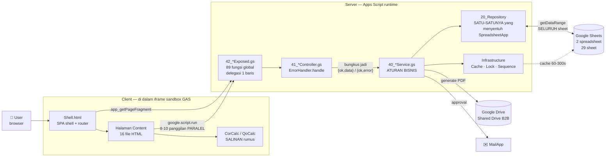

**Klaim diagram ini:** setiap permintaan menembus 5 lapis, dan **`20_Repository` adalah satu-satunya pintu ke Sheets** — itulah sebabnya migrasi ke database sungguhan tidak perlu menyentuh Service Layer. Perhatikan juga dua hal yang jadi sumber masalah: **8-10 panggilan paralel per halaman** (§10.2) dan **`CorCalc` sebagai salinan rumus di client** (§9.7). → detail §2.1

---

### V2. Peta 17 modul & siapa memanggil siapa

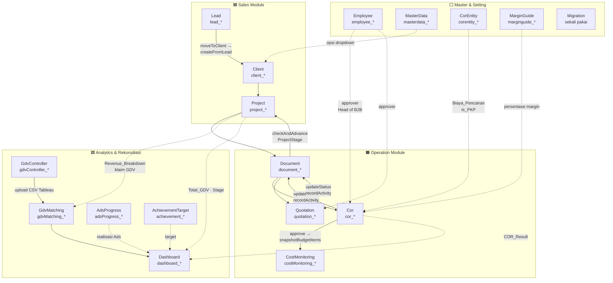

**Garis penuh = pemanggilan langsung antar Service** (pengecualian arsitektur yang disengaja & didokumentasikan). **Garis putus-putus = ketergantungan data**, bukan pemanggilan kode. Modul umumnya tidak boleh saling panggil; yang ada di sini adalah transaksi yang secara alami melibatkan 2 entitas. → detail §2.1

---

### V3. Alur bisnis end-to-end — dari form publik sampai rekonsiliasi biaya

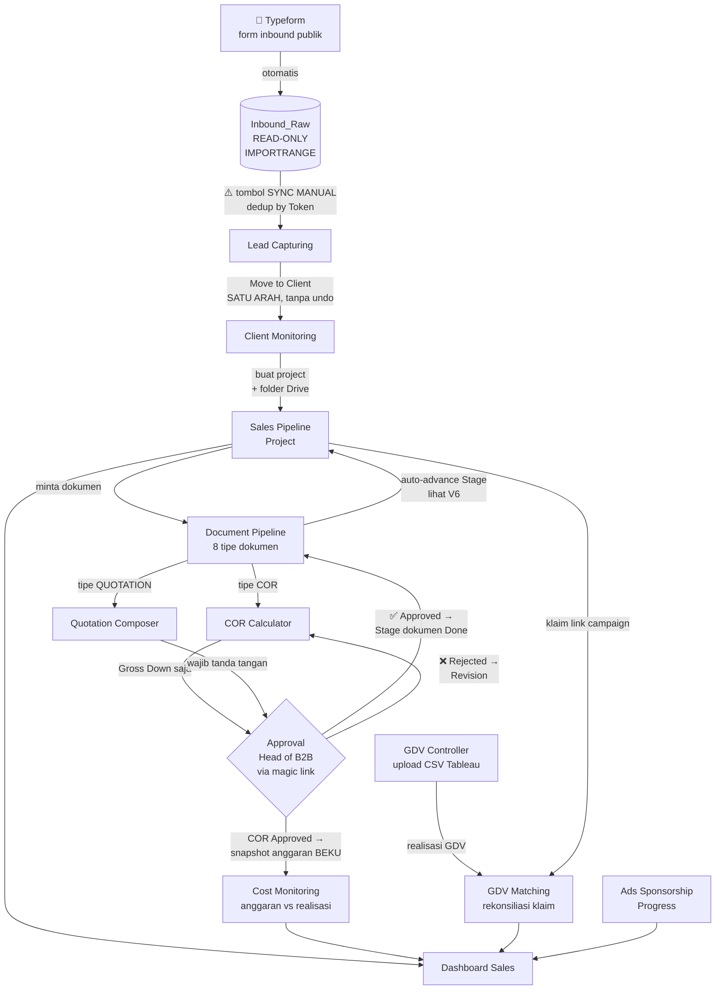

**Klaim:** hanya ada **satu titik masuk otomatis** (Typeform → Inbound_Raw), sisanya digerakkan aksi manusia. **Tidak ada satu pun time-driven trigger** di seluruh platform. Perhatikan dua jalur yang tidak bisa dibatalkan: Move to Client, dan snapshot anggaran saat approval. → detail §4.1

---

### V4. State machine Lead — `Moved` adalah pintu satu arah

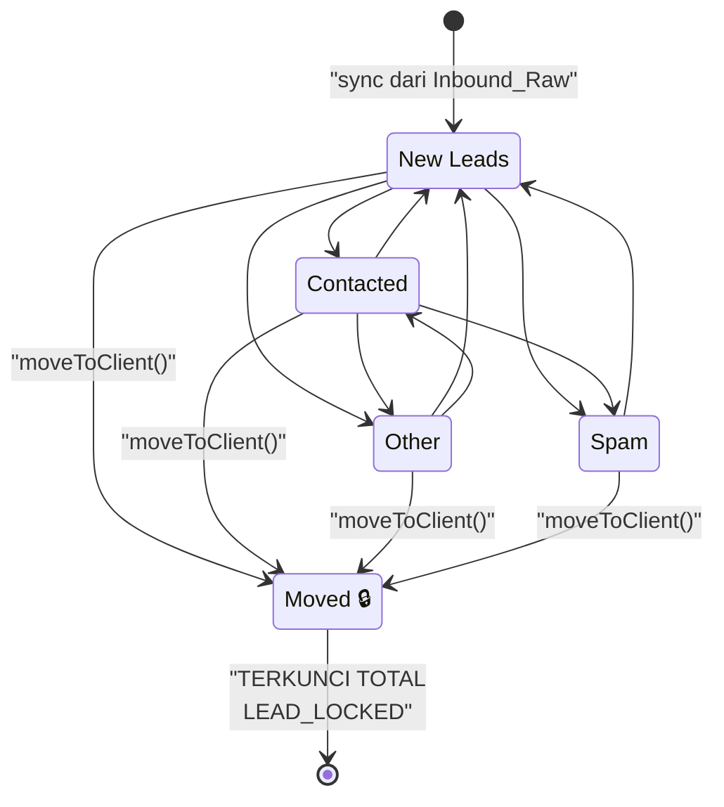

**Dua aturan yang ditegakkan server:** (1) transisi antar status non-`Moved` **bebas tanpa urutan** — `New Leads` → `Spam` langsung sah; (2) `Moved` **hanya** bisa dicapai lewat `moveToClient()`, dan begitu tercapai **seluruh baris terkunci** (`updateLead` melempar `LEAD_LOCKED`). → detail §4.3

---

### V5. State machine Project.Stage — tiga jalur dengan aturan berbeda

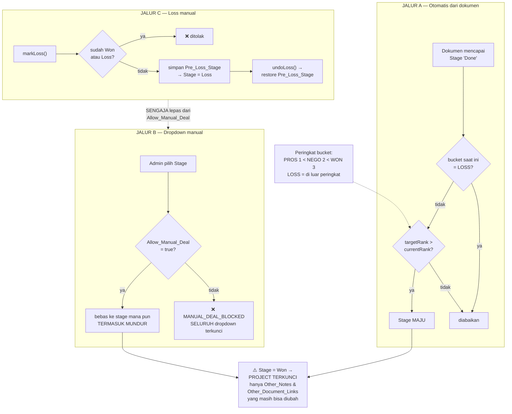

**Klaim:** jalur otomatis **hanya bisa maju dan tidak pernah menyentuh project yang sudah `Loss`**; jalur manual terkunci total kecuali toggle dinyalakan; jalur Loss sengaja dibuat lepas dari toggle itu. `Won` mengunci hampir seluruh field project. → detail §4.3

---

### V6. Algoritma auto-advance Stage project dari dokumen

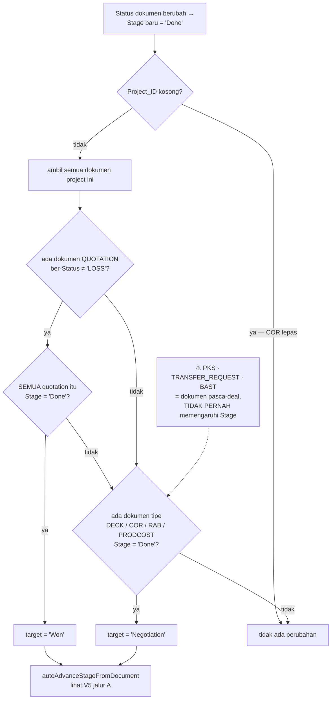

**Konsekuensi bisnis yang penting:** project yang **tidak pernah minta Quotation tidak bisa `Won` otomatis** — harus lewat toggle `Allow_Manual_Deal`. Dan COR tanpa project (`Project_ID` kosong) tidak pernah memengaruhi Stage siapa pun. → detail §4.3

---

### V7. State machine dokumen COR & Quotation — putaran approval

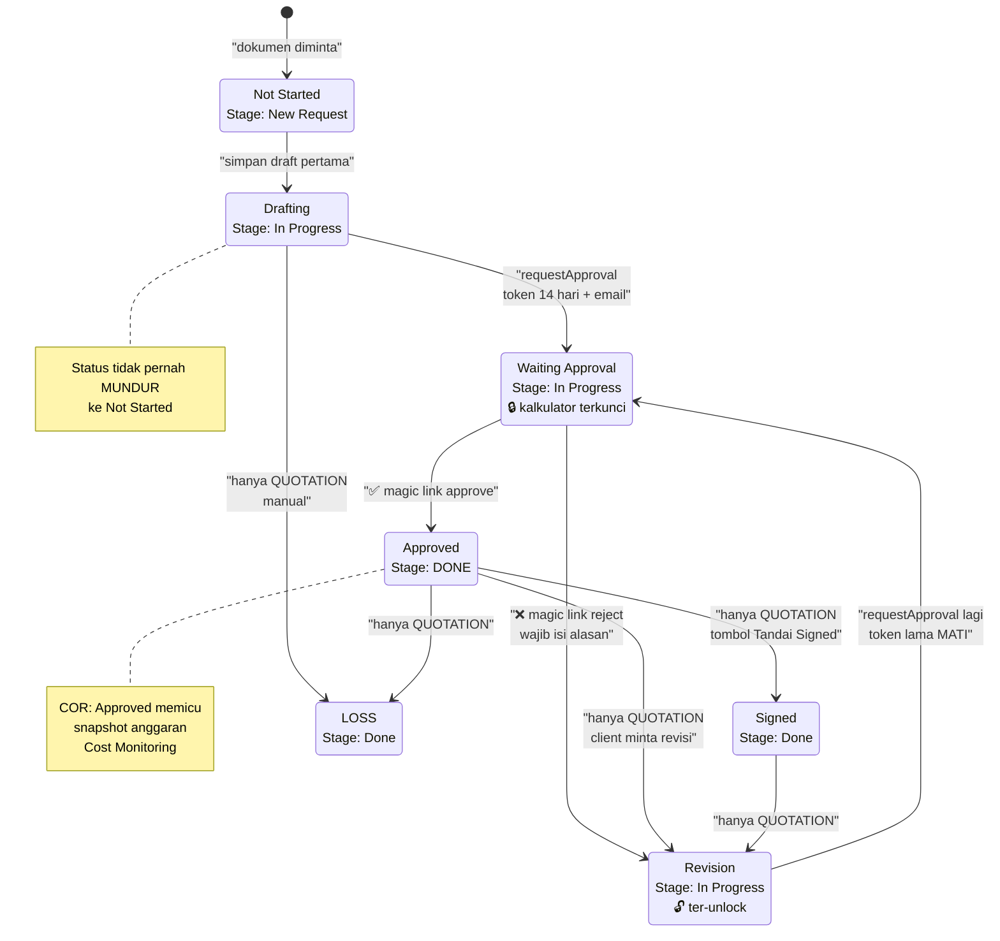

**Yang membedakan COR dan Quotation:** COR berhenti di `Approved`; Quotation punya 3 transisi manual sesudahnya karena **proses tanda tangan client dilakukan di luar sistem**. `Approved` untuk Quotation = approval **internal Head of B2B**, bukan "client sudah tanda tangan". → detail §4.3

---

### V8. Status 6 tipe dokumen lainnya — semuanya linear

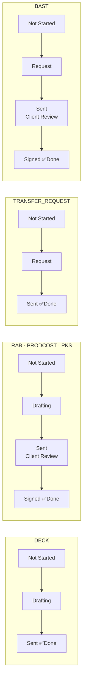

Keenam tipe ini **tidak punya approval internal** — statusnya diubah manual lewat dropdown. Semua Stage universal: `New Request` → `In Progress` → `Client Review` → `Done`. → detail §4.3

---

### V9. ⚠️ Di mana otorisasi ditegakkan — dan di mana tidak

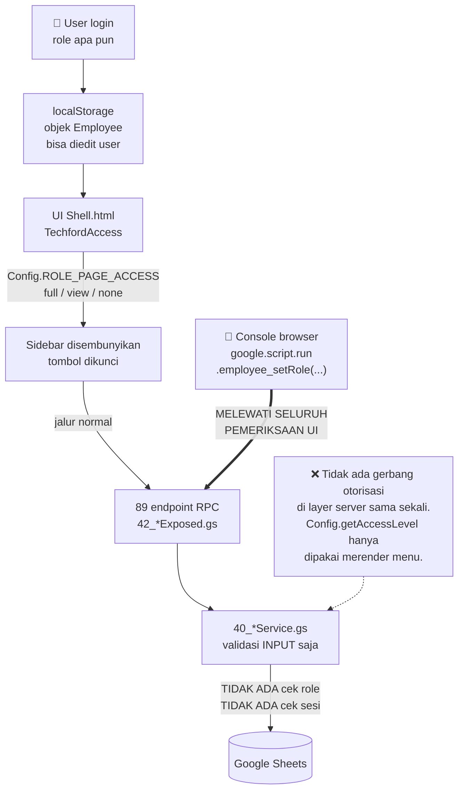

**Ini temuan keamanan utama.** Seorang Consultant bisa memanggil `employee_setRole(myId,'Master Admin')`, `client_delete(...)`, atau `document_updateStatus(docId,'Approved')` langsung dari console — UI menyembunyikan tombolnya, **server tidak menolaknya**. Digabung dengan V10, artinya **integritas data bergantung pada UI**. → detail §7.4

---

### V10. ⚠️ State machine dokumen tidak ditegakkan di server

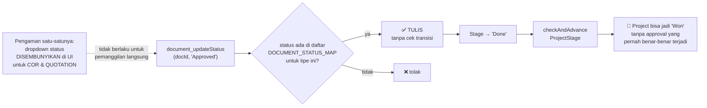

`updateStatus` hanya memvalidasi bahwa status **ada di daftar tipe itu** — bukan bahwa transisinya sah. `Not Started` → `Approved` langsung diizinkan. → detail §4.3

---

### V11. Mesin COR — Gross Down, urutan tidak boleh diubah

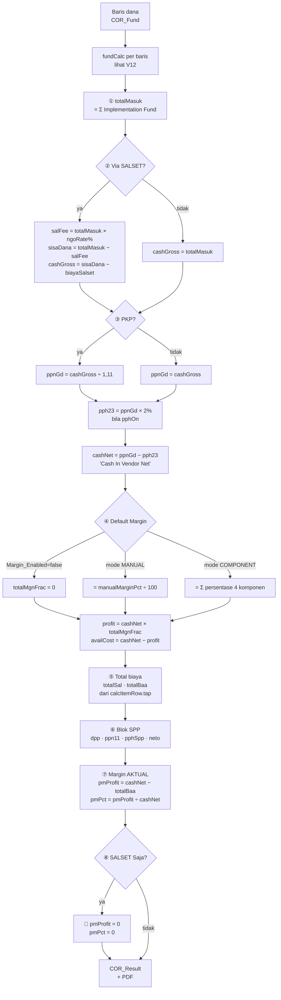

**Langkah ⑧ wajib ada.** COR "SALSET Saja" tidak lewat vendor, jadi `totalBaa` selalu 0 → `cashNet − 0` akan salah membaca **seluruh sisa dana sebagai profit**. Ini bug nyata yang pernah terjadi di produksi. Perhatikan juga bahwa **margin aktual (⑦) independen dari Default Margin (④)**. → detail §5.3

---

### V12. `fundCalc` — fee per baris dana

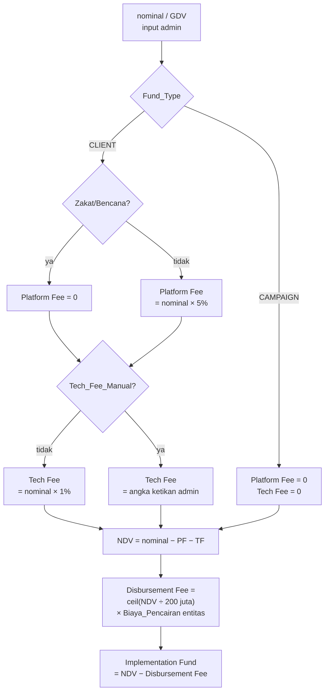

**Aturan yang paling mudah salah:** Platform Fee **nol** untuk Zakat/Bencana, tapi **Tech Fee tetap 1%**. Dana `CAMPAIGN` tidak dikenakan keduanya. Biaya admin dikenakan **per kelipatan Rp200 juta, dibulatkan ke atas**. → detail §5.2

---

### V13. Gross Up — arah kebalikan, semua pembagian adalah gross-up

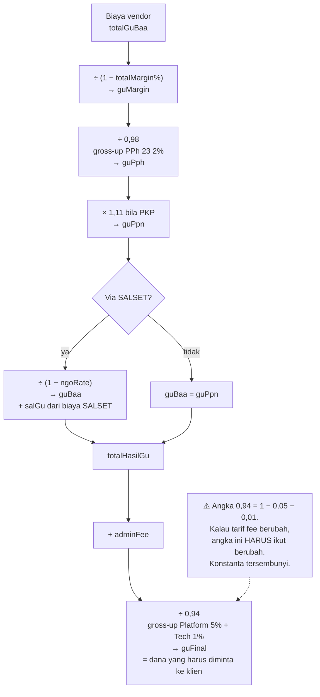

Gross Up dipakai saat **dana belum masuk** — alat nego consultant. **Tidak bisa diajukan approval**; harus dikonversi ke Gross Down dulu (satu arah, `Gross_Up_Snapshot` disimpan). → detail §5.4

---

### V14. Approval COR — 3 gerbang token & magic link tanpa login

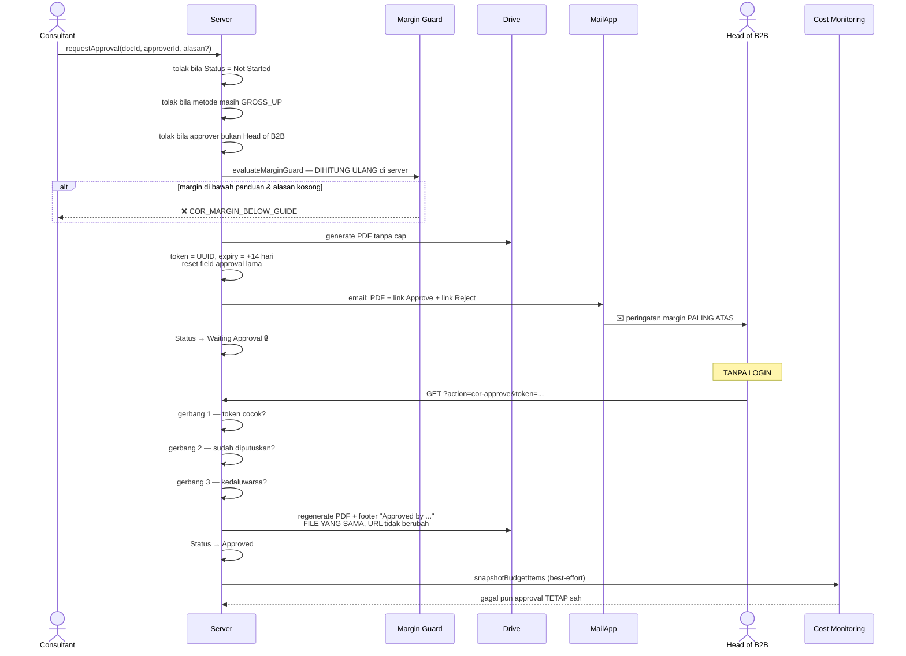

**Tiga gerbang punya pesan berbeda dengan sengaja** — "link tidak valid" untuk tautan yang cuma kedaluwarsa akan membuat orang mengira sistemnya rusak, lalu meneruskan email lama ke orang lain. → detail §5.8

---

### V15. Cost Monitoring — anggaran beku vs realisasi berjalan

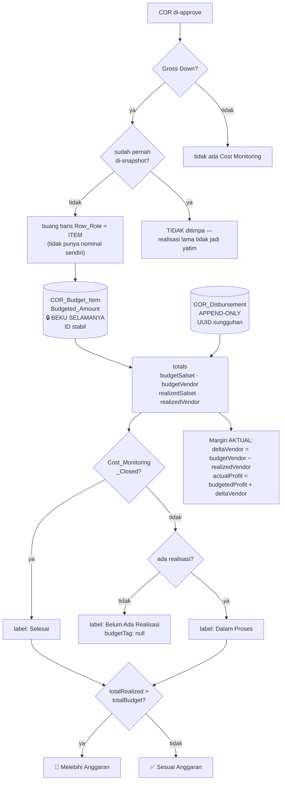

**Aturan bisnis inti:** margin/profit **hanya dipengaruhi realisasi Cost VENDOR**. Cost Salset tetap dimonitor tapi murni operasional. "Melebihi Anggaran" dihitung **agregat per dokumen** (mencampur Salset + Vendor) — satu item boleh over selama total masih di bawah. **Tidak ada validasi yang memblokir realisasi melebihi anggaran** — cuma ditandai. → detail §6.2

---

### V16. GDV Matching — rekonsiliasi klaim consultant vs realisasi Tableau

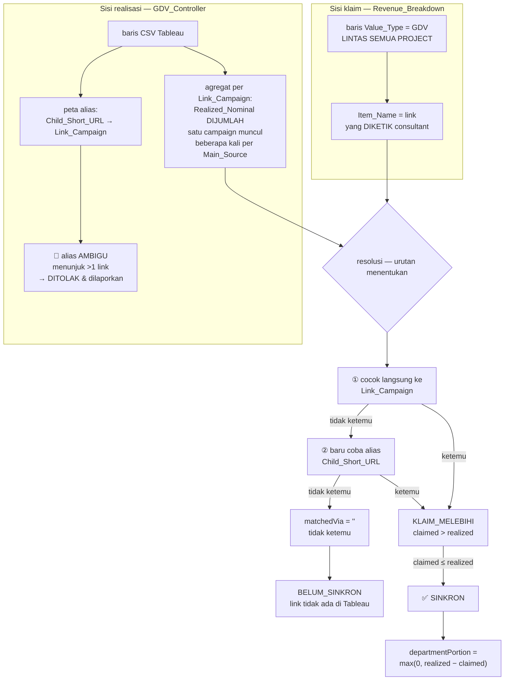

**Tiga aturan penjagaan yang harus dipertahankan:** (1) pencocokan langsung **selalu menang atas alias** — supaya child URL baru tidak bisa membajak link yang sudah punya arti; (2) child URL yang kebetulan juga sebuah `Link_Campaign` **tidak pernah dijadikan alias**; (3) alias ambigu **ditolak & dilaporkan ke manusia, bukan ditebak**. → detail §9.5

---

### V17. Dua pola upload CSV yang sengaja berbeda

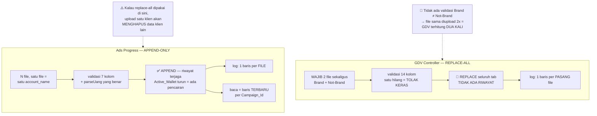

**Kenapa berbeda:** export Ads datang **per klien**, jadi replace-all akan menghapus data klien lain — dan "progress" memang soal pergerakan saldo. Keduanya memakai pencocokan header ternormalisasi + auto-detect delimiter tab/koma. → detail §9.3 & §9.4

---

### V18. Struktur folder Drive & tiga sumber lampiran

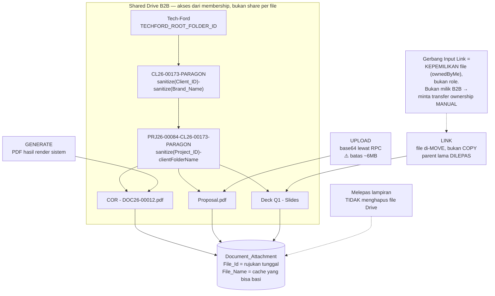

**Folder ID disimpan; folder tidak pernah dicari lewat nama** — nama murni kosmetik, dan folder di-rename kalau `Brand_Name` berubah (idempoten, self-healing kalau folder di-trash). ⚠️ Tapi rename **tidak pernah dipanggil dari jalur update** — fungsi `syncClientFolderName` yang dijanjikan docstring tidak ada. → detail §9.2

---

### V19. 🚨 Tiga salinan rumus COR — risiko tertinggi di kodebase ini

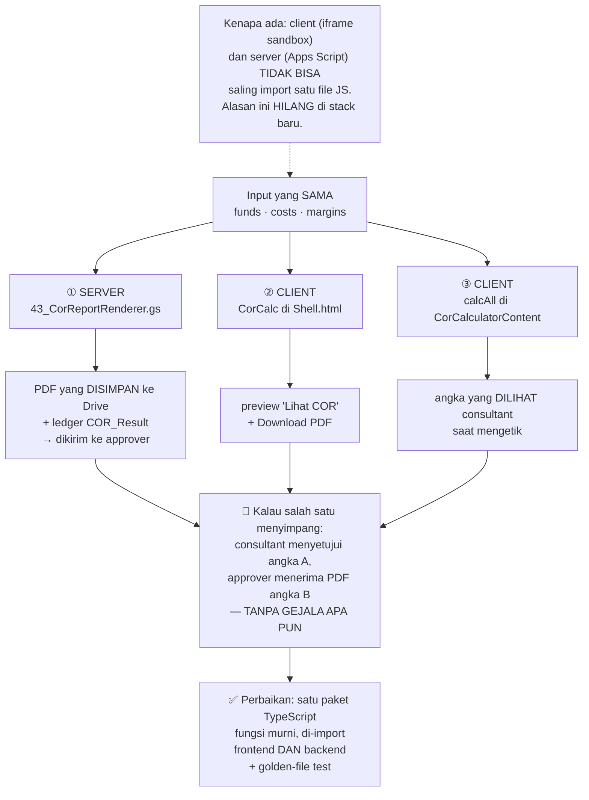

**Sudah ada bukti drift historis:** `marginEnabled`/`marginMode` dulu tidak ikut dikirim ke `buildPdfModel`, sehingga Download PDF selalu menampilkan Default Margin walau toggle dimatikan — sementara "Lihat COR" sudah benar. Yang diduplikasi bukan formatting, tapi **rumus pajak & fee**. → detail §9.7

---

### V20. Mekanisme kolapsnya platform — kenapa rate limit terjadi

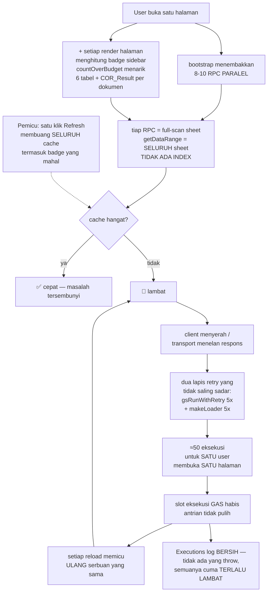

**Klaim:** ini **loop yang bertahan sendiri**, bukan kegagalan sesaat — dan tidak terlihat di log server karena tidak ada exception. Empat pola yang harus dihindari di stack baru: full-scan tanpa index, fan-out RPC per halaman, retry bertingkat, invalidasi cache terlalu luas. → detail §10

---

### V21. Peta data — entitas & relasi

```mermaid
erDiagram
  EMPLOYEE ||--o{ PROJECT : "consultant"
  EMPLOYEE ||--o| ACHIEVEMENT_TARGET : "target"
  LEAD |o--|| CLIENT : "moveToClient"
  CLIENT ||--o{ PIC_CLIENT : "punya"
  CLIENT ||--o{ PROJECT : "punya"
  PROJECT ||--o{ REVENUE_BREAKDOWN : "GDV & Service"
  PROJECT ||--o{ DOCUMENT_PIPELINE : "dokumen"
  DOCUMENT_PIPELINE ||--o{ DOCUMENT_ATTACHMENT : "lampiran"
  DOCUMENT_PIPELINE ||--o{ DOCUMENT_ACTIVITY : "riwayat approval"
  DOCUMENT_PIPELINE ||--o| COR_HEADER : "bila tipe COR"
  DOCUMENT_PIPELINE ||--o| QUOTATION_HEADER : "bila tipe QUOTATION"
  COR_HEADER ||--o{ COR_FUND : "sumber dana"
  COR_HEADER ||--o{ COR_COST : "item biaya"
  COR_HEADER ||--o{ COR_MARGIN : "4 atau 8 baris"
  COR_HEADER ||--o{ COR_RESULT : "1 atau 2 per tab"
  COR_HEADER ||--o{ COR_BUDGET_ITEM : "snapshot beku"
  COR_BUDGET_ITEM ||--o{ COR_DISBURSEMENT : "realisasi"
  QUOTATION_HEADER ||--o{ QUOTATION_ITEM : "item"
  QUOTATION_HEADER }o--|| PIC_CLIENT : "snapshot PIC"
  COR_ENTITY ||--o{ COR_HEADER : "vendor (join NAMA)"
  MARGIN_GUIDE ||--o{ COR_MARGIN : "snapshot NILAI"
  MASTER_DATA ||--o{ CLIENT : "opsi dropdown"
  ADS_UPLOAD_LOG ||--o{ ADS_PROGRESS : "batch"
  REVENUE_BREAKDOWN }o--o{ GDV_CONTROLLER : "join SLUG URL"
```

**Yang perlu diperhatikan:** relasi bergaris "join NAMA" / "join SLUG URL" adalah **relasi lemah lewat teks**, bukan FK sungguhan — semuanya wajib diperbaiki jadi FK di stack baru. `COR_BUDGET_ITEM` adalah **satu-satunya ID anak COR yang stabil** (yang lain berubah setiap simpan karena pola replace-all). → detail §3.11

---

### V22. Peta 16 halaman & data yang dibacanya

```mermaid
flowchart LR
  subgraph DASH["Dashboard Analytics"]
    P1["Dashboard Sales"]
  end
  subgraph SALES["Sales Module"]
    P2["Lead Capturing"]
    P3["Client Monitoring"]
    P4["Sales Pipeline"]
  end
  subgraph OPS["Operation Module"]
    P5["Document Pipeline"]
    P6["COR Calculator"]
    P7["Quotation Composer"]
    P8["Cost Monitoring"]
  end
  subgraph SET["Setting"]
    P9["Master Data"]
    P10["Configure Account"]
    P11["Achievement Setting"]
    P12["GDV Controller"]
    P13["GDV Matching"]
    P14["Ads Progress"]
  end

  P2 --> S1[("Lead · Inbound_Raw")]
  P3 --> S2[("Client · PIC_Client<br/>Master_Data · Project")]
  P4 --> S3[("Project · Revenue_Breakdown<br/>Client · Employee · Document")]
  P5 --> S4[("Document_Pipeline · Attachment<br/>Activity · COR_Header · Quotation")]
  P6 --> S5[("COR_Header/Fund/Cost/Margin<br/>COR_Entity · Margin_Guide")]
  P7 --> S6[("Quotation_Header/Item")]
  P8 --> S7[("COR_Budget_Item<br/>COR_Disbursement · COR_Result")]
  P1 --> S8[("SEMUA di atas +<br/>GDV_Controller + Achievement")]
  P12 --> S9[("GDV_Controller<br/>+ Upload_Log")]
  P13 --> S9
  P14 --> S10[("Ads_Progress<br/>+ Upload_Log")]
  P9 --> S11[("Master_Data · COR_Entity<br/>Margin_Guide")]
  P10 --> S12[("Employee")]
  P11 --> S13[("Achievement_Target")]

  NOTE["⚠️ Dashboard Sales membaca<br/>DUA spreadsheet sekaligus —<br/>karena itu ia dipecah jadi<br/>2 RPC terpisah, supaya satu sisi<br/>yang gagal tidak menggelapkan<br/>seluruh halaman"]
  NOTE -.-> P1
```

Halaman yang paling berat = **Document Pipeline** (10 RPC bootstrap) dan **Dashboard Sales** (dua spreadsheet). → detail §8 & §9.8

---

## 1. Apa itu Techford & kenapa pindah stack

### 1.1 Ringkasan produk

Techford adalah **internal operating system untuk tim B2B Kitabisa** — mengelola seluruh siklus kerja sama korporat, dari lead masuk sampai rekonsiliasi biaya:

```
Typeform (form inbound publik)
    ↓
Lead Capturing ────→ Client Monitoring ────→ Sales Pipeline (Project)
                                                    ↓
                                          Document Pipeline
                                    (Deck / Quotation / COR / RAB /
                                     Prodcost / PKS / Transfer Req / BAST)
                                                    ↓
                                    COR Calculator ──→ approval Head of B2B
                                                    ↓
                                            Cost Monitoring
                                        (anggaran vs realisasi)

Pendukung: Dashboard Sales, GDV Controller (upload CSV Tableau),
           GDV Matching, Ads Sponsorship Progress, Master Data,
           Achievement Setting, Configure Account
```

**Skala pemakaian:** internal, puluhan user (Consultant, Operation, Head of B2B, Master Admin). Bukan aplikasi publik.

### 1.2 Kenapa harus pindah — akar masalahnya

Platform ini memakai **Google Sheets sebagai database** dan **Google Apps Script (GAS) sebagai runtime**. Keduanya punya batas keras yang tidak bisa dinaikkan:

| Batas | Angka | Dampak nyata |
|---|---|---|
| Eksekusi maksimum | 6 menit per pemanggilan | Impor besar harus dipecah manual |
| Baca sheet | Tidak ada index — `getDataRange()` membaca **seluruh sheet** | Makin banyak baris, makin lambat SEMUA query |
| Concurrent execution per user | Terbatas & di-queue | 8–10 permintaan paralel per halaman sudah cukup untuk menyumbat |
| Transport `google.script.run` | Payload besar sering gagal dikirim balik | Halaman "gagal memuat" walau server sukses |
| Rate limit Google Sheets | Tidak terdokumentasi publik, transient | `Service Spreadsheets failed while accessing document` |

**Insiden yang memicu keputusan migrasi (21 Agustus 2026):** hampir semua halaman gagal memuat data. Server Apps Script **selalu sukses** (Executions log bersih, durasi wajar), tapi respons tidak pernah sampai ke browser. Sudah dibuktikan bukan bug kode, bukan browser, bukan jaringan, bukan deployment, bukan akun. Kesimpulan tim IT/Infra: **rate limit** di level infrastruktur Google — dan akan berulang seiring data bertambah.

Yang penting dipahami: **ini bukan kegagalan desain aplikasinya.** Arsitekturnya justru sudah mengantisipasi ini sejak awal — `ARCHITECTURE.md:99` sudah menulis kapan platform harus bermigrasi, dan Repository Layer sengaja diisolasi supaya migrasi tidak menyentuh logika bisnis. Yang tercapai sekarang adalah **titik itu**, lebih cepat dari perkiraan.

### 1.3 Apa yang harus dipertahankan (aset nyata)

Jangan buang ini — ini hasil ±8 bulan iterasi dengan user sungguhan:

1. **Aturan bisnis & rumus finansial** (bagian 5 & 6) — sudah divalidasi tim finance/ops lewat pemakaian nyata. Salah sedikit di sini artinya salah hitung uang.
2. **State machine dokumen** (bagian 4) — status per tipe dokumen, siapa boleh apa.
3. **Test suite 40 file / ±1.350 assertion** (bagian 11) — ini spesifikasi yang bisa dieksekusi. Banyak di antaranya menjaga bug nyata yang pernah terjadi.
4. **Model hak akses per role** (bagian 7).
5. **Struktur data** (bagian 3) — sudah ternormalisasi cukup baik untuk langsung dipetakan ke SQL.

Yang **tidak** perlu dipertahankan: seluruh lapisan Presentation (HTML/JS di dalam GAS), pola `google.script.run`, `CacheHelper` chunking, `LockHelper` — semua itu tambalan untuk keterbatasan GAS yang tidak akan ada di stack baru.

---

## 2. Arsitektur lama & bagian yang bisa dipakai ulang

### 2.1 Layer

Kode lama berlapis tegas (`ARCHITECTURE.md:12`), dan ini kabar baik untuk migrasi:

```
50_Presentation/   ← BUANG (HTML + google.script.run, spesifik GAS)
   ├── 50_WebAppRouter.gs      routing + doGet (SPA fragment)
   └── html/*.html             16 halaman UI

40_Modules/        ← PERTAHANKAN LOGIKANYA (ini aset utama)
   └── <Modul>/
        40_<X>Service.gs       ATURAN BISNIS  ← port ke backend baru
        41_<X>Controller.gs    validasi input tipis
        42_<X>Exposed.gs       jembatan ke client (jadi REST endpoint)
        43_<X>Renderer.gs      generator PDF/HTML

30_Service/        ← notifikasi email
20_Repository/     ← GANTI TOTAL (akses Sheets → SQL)
10_Infrastructure/ ← SEBAGIAN BESAR TIDAK PERLU LAGI
   ├── LockHelper           tidak perlu (DB punya transaksi)
   ├── CacheHelper          tidak perlu (chunking khusus limit Sheets)
   ├── SequenceService      ganti sequence/serial DB
   ├── SyncStateService     mungkin masih relevan
   └── DriveFolderService   masih relevan kalau tetap pakai Drive

00_Core/           ← Config.gs = KAMUS ENUM, sangat berguna, port sebagai konstanta
```

**Implikasi praktis:** file `40_*Service.gs` adalah tempat aturan bisnis hidup, dan sengaja **tidak** menyentuh SpreadsheetApp langsung (`20_BaseRepository.gs:4` — "INI ADALAH SATU-SATUNYA LAYER YANG BOLEH MEMANGGIL SpreadsheetApp SECARA LANGSUNG"). Jadi Service Layer bisa dibaca sebagai pseudocode aturan bisnis yang hampir bebas dari detail GAS.

### 2.2 Statistik kodebase

| Bagian | Baris |
|---|---|
| Total | ±39.300 |
| Presentation (HTML/UI) | ±24.000 (61%) — akan dibuang/ditulis ulang |
| Service/Module (aturan bisnis) | ±7.500 — **inti yang diport** |
| Repository | ±2.500 — diganti |
| Core + Infrastructure | ±2.300 |
| Test | terpisah, 40 file |

Artinya: yang benar-benar perlu "dipahami dan dipindahkan" sekitar **7.500 baris logika bisnis**, bukan 39.000.

---

## 3. Data model

### 3.0 Infrastruktur penyimpanan

**DUA spreadsheet terpisah**, bukan satu:

| | Spreadsheet ID | Konstanta | Isi |
|---|---|---|---|
| DB utama | `1DXjYDtL6QEqGvBDnQHGMiSqIXX9EHiBOiPmJsyz3tdM` | `Config.SPREADSHEET_ID` | 25 sheet operasional |
| DB terpisah | `15alu24X-_98FZxUEO4UuxnKcpnHqhPIJf4-XdrvgwMo` | `Config.GDV_CONTROLLER_SPREADSHEET_ID` | 4 tab hasil upload CSV Tableau |

**Penyimpanan NON-sheet yang WAJIB ikut dimigrasi** (paling mudah terlewat):
- `PropertiesService` → counter ID: key `SEQ_<KEY>_<YY>` (`12_SequenceService.gs:15`)
- `PropertiesService` → key `SYNC_INBOUND_RAW` = bookmark timestamp sync Typeform terakhir (`13_SyncStateService.gs:12`)
- `localStorage` browser → sesi login user + nav favorites (bukan data domain, tapi menjelaskan kenapa tidak ada tabel session)

> **Peringatan penting:** Sheets tidak punya tipe kolom. Yang tertulis sebagai "tipe" di bawah adalah tipe JS yang **sebenarnya ditulis oleh service**, bukan constraint. Nilai apa pun bisa masuk.

### 3.1 Pola ID — ada TIGA generator berbeda

**(a) `SequenceService` — berurut, human-readable.** Format `<PREFIX><YY>-<nomor>`, counter reset tiap tahun.

| Entitas | Format | Digit |
|---|---|---|
| `Lead.Inbound_ID` | `INB26-00001` | 5 |
| `Client.Client_ID` | `CL26-00001` | 5 |
| `Project.Project_ID` | `PRJ26-00001` | 5 |
| `Document_Pipeline.Doc_ID` | `DOC26-00001` | 5 |
| `Quotation_Number` (bukan PK) | `QO/0001/VIII/2026/KAI/CL26-00001` | 4 |

> Docstring `12_SequenceService.gs:5` menulis contoh `CL26-0001` (4 digit) — **itu salah**, `CLIENT_ID_DIGITS = 5`.

**(b) `Utils.generateId(prefix)` — acak, TIDAK STABIL.** Format `<PREFIX>-<ts36><rand5>`. Dipakai untuk: `EMP`, `PIC`, `DRAFT`, `RB`, `FUND`, `COST`, `CORMG`, `CORRES`, `BUDGET`, `QOI`, `ATT`, `ACT`, `ENT`, `MG`, `ACH`, `ADSLOG`.

**(c) `Utilities.getUuid()` — UUID sungguhan.** Sengaja hanya untuk 3 hal: `COR_Disbursement.Disbursement_ID` (*"realisasi adalah catatan uang sungguhan, ID-nya harus benar-benar tidak mungkin bentrok"*), `Approval_Token`, dan `GDV_Controller_Upload_Log.Log_ID`.

### 3.2 Konsep `ensureColumns` — kolom self-migrating

Banyak sheet punya kolom yang **ditambahkan runtime** oleh kode saat fitur baru dipakai pertama kali (`sheet.getRange(1, lastCol).setValue(name)`). Ada 28 titik pemanggilan.

**Konsekuensi untuk migrasi:**
1. Urutan kolom di spreadsheet produksi **tidak sama** dengan urutan di docstring — kolom self-migrating selalu di paling kanan, urutan tergantung fitur mana dipakai lebih dulu.
2. Kode membaca berdasarkan **nama header**, bukan posisi — jadi urutan tidak penting bagi aplikasi, tapi penting saat export CSV.
3. `ensureColumns` **tidak pernah menghapus** kolom → bisa ada kolom usang yang tidak dipakai kode mana pun.

### 3.3 Tabel — Identitas & akses

#### `Employee`
`Id`(PK) · `Name` · `Email` · `Role` · `PasswordHash` · `Status` · `CreatedAt`

- `Email` UNIQUE de-facto (dicek case-insensitive), **wajib `@kitabisa.com`**
- `Role` ENUM 4 nilai: `Master Admin` · `Consultant` · `Operation` · `Head of B2B`
- **Nilai Role lama/tak dikenal (termasuk default lama `'Admin'`) dibaca sebagai `Operation`**, bukan ditolak → data produksi bisa berisi string di luar 4 nilai itu
- `Status`: `Active` | `Inactive`. Tidak ada delete, hanya deaktivasi
- **Invariant bisnis:** platform WAJIB punya ≥1 Master Admin `Active` → jadikan constraint/trigger
- `PasswordHash`: SHA-256 **tanpa salt** → **jangan migrasikan hash-nya**, minta reset

#### `Master_Data` — tabel opsi dropdown generik
`Category` · `Value` · `CreatedAt`

- **TIDAK ADA PK.** Kunci logis = (`Category`, `Value`) → beri surrogate PK + unique di Postgres
- `Category` ENUM 4: `Head_Office` · `Industry` · `Entity_Type` · `Client_Source`
- **Append-only de-facto** — repository tidak punya `update` maupun `delete`, jadi opsi yang sudah dibuat **tidak bisa dihapus dari aplikasi**
- Peran arsitektur: "enum sebagai data" supaya admin bisa tambah opsi tanpa deploy → di Postgres jadikan **tabel referensi**, bukan tipe ENUM native

### 3.4 Tabel — Lead funnel

#### `Inbound_Raw` — READ-ONLY (bukan tabel, ini integrasi)
Header = **teks pertanyaan Typeform apa adanya**, termasuk satu header berisi UUID Typeform mentah. Sel dikontrol formula IMPORTRANGE → tidak bisa ditulis. Kunci dedup de-facto: kolom `Token`.

> **Docstring `25_InboundRawRepository.gs:9-12` SUDAH BASI** — menulis nama pendek (`kebutuhan`, `prioritas`) yang sudah dinyatakan salah oleh `00_Config.gs:132-136`. **Pakai `Config.INBOUND_RAW_HEADERS`.**

#### `Lead`
`Inbound_ID`(PK) · `Timestamp` · `Status` · `Entity_Name` · `Entity_Type` · `PIC_Name` · `Email` · `Phone` · `Detail_Interest` · `Priority_Notes` · `UTM_Source` · `UTM_Medium` · `UTM_Campaign` · `Last_Updated` · `Other_Notes`

**Self-migrating:** `Entity_Type_Other` · `Source_Token` · `Client_ID`(FK)

- `Status` ENUM 5: `New Leads` · `Contacted` · `Moved` · `Other` · `Spam`
- `Entity_Type` ENUM 4: `Perusahaan` · `Institusi Sosial` · `Institusi Grants` · `Other`
- Baris tanpa `Inbound_ID` **dibuang saat baca**
- ⚠️ `Detail_Interest` ← pertanyaan **PRIORITAS**; `Priority_Notes` ← pertanyaan **KEBUTUHAN**. **Menyilang, disengaja** — jangan "diperbaiki"

#### `Lead_Migration` — staging sekali pakai
**Untuk migrasi: BUANG.** Scaffolding impor CSV lama, bukan bagian model domain.

### 3.5 Tabel — Client

#### `Client`
`Client_ID`(PK) · `Brand_Name` · `Entity_Name` · `Entity_Type` · `Head_Office` · `Website` · `Industry` · `Client_Source` · `Is_From_Lead` · `Created_Date` · `Created_By` · `Other_Notes` · `Last_Updated`

**Self-migrating:** `Entity_Type_Other` · `Drive_Folder_Id`

- `Brand_Name` & `Entity_Name` **selalu di-UPPERCASE** oleh service
- `Is_From_Lead` boolean, **immutable**. Kalau `true` → `Client_Source` terkunci `Inbound`
- `Head_Office`/`Industry`/`Client_Source` divalidasi terhadap `Master_Data` (relasi lemah, bukan FK)
- Hard delete ada, tapi hanya via service yang lebih dulu memastikan tidak ada project menggantung → **`ON DELETE RESTRICT`** dari `Project`

#### `PIC_Client`
`PIC_ID`(PK) · `Client_ID`(FK) · `PIC_Name` · `Title` · `Email` · `Phone` · `Created_Date`
**Self-migrating:** `Is_Primary`

- Invariant: maksimal 1 primary per client, ditegakkan dengan menulis ulang semua PIC client itu
- ⚠️ **`Is_Primary` bisa seluruhnya kosong/false untuk data lama** — sebelum kolom ini ada, "PIC Utama" cuma `findAll()[0]`. Fallback itu **masih aktif**. Jangan asumsikan tepat 1 primary per client saat migrasi

### 3.6 Tabel — Sales Pipeline

#### `Project`
`Project_ID`(PK) · `Project_Name` · `Client_ID`(FK) · `Consultant` · `Services`(JSON) · `Service_Categories`(JSON) · `Program_Type` · `Program_Category` · `Program_Name` · `Issues`(JSON) · `Other_Notes` · `Is_Retainer` · `Allow_Manual_Deal` · `Stage` · `Total_GDV` · `Total_Service_Revenue` · `Other_Document_Links`(JSON) · `Is_Draft` · `Created_Date` · `Created_By` · `Last_Updated`

**Self-migrating (6):** `Pre_Loss_Stage` · `Stage_Changed_Date` · `Consultant_Employee_ID`(FK) · `Ads_Kpi_Target` · `Drive_Folder_Id`

- `Program_Type` ENUM 2: `KB.ORG Program` · `Client Program`
- `Stage` ENUM 4: `Prospect` · `Negotiation` · `Won` · `Loss`
- ⚠️ **Data lama masih pakai nilai granular yang sudah dihapus:** `First Approaching`, `Follow Up User` (→ Prospect); `Drafting Deck`, `Revision` (→ Negotiation). **Cek data produksi.**
- `Total_GDV` & `Total_Service_Revenue` = **turunan**, SUM dari `Revenue_Breakdown`, dihitung ulang di server
- ⚠️ `Ads_Kpi_Target`: **`''` dan `0` sengaja BEDA** — "belum ditetapkan" vs "target nol". Di Postgres: **nullable numeric, JANGAN `DEFAULT 0`**

**Nilai valid isi kolom JSON** (semua hardcode di Config, BUKAN Master_Data):

| Kolom | Nilai valid |
|---|---|
| `Services` | `CSR` · `Sustainability Services` · `Event` · `Ads Sponsorship` · `Placement & Production` |
| `Service_Categories` | CSR: Corporate/Employee/Customer/Public Donation, Zakat · Sustainability: Monitoring & Evaluation, Impact Measurement · Event: Beyond The Game, Voluntrip, Ekspedisi Kitabisa · Ads Sponsorship & Placement: `[]` (sengaja tanpa kategori) |
| `Issues` | `Social` · `Health` · `Empowerment` · `Education` · `Environment` · `Momentum` |
| `Program_Category` | `Teach4Hope` · `Ganavira` · `Askara Nusantara` · `Generasi Sehat` · `Harpa` · `Custom Program` |

#### `Revenue_Breakdown`
`Breakdown_ID`(PK) · `Project_ID`(FK) · `Value_Type` · `Item_Name` · `Amount` · `Notes` · `Created_By` · `Created_Date` · `Last_Updated`
**Self-migrating:** `Entry_Date` · `Source_Service`

- `Value_Type` ENUM 2: `GDV` · `SERVICE`
- ⚠️ **`Item_Name` POLIMORFIK:** kalau `GDV` → link campaign (slug URL); kalau `SERVICE` → nama category/service. **Di Postgres: pisah jadi 2 tabel, atau kolom bermakna terpisah**
- **REPLACE-PER-PROJECT** setiap save → `Breakdown_ID` berubah tiap save, **jangan jadikan FK dari mana pun**
- Baris Ads Sponsorship selalu `Amount = 0` (nominal riilnya dari `Ads_Sponsorship_Progress`)

#### `Achievement_Target`
`Target_ID`(PK) · `Consultant_Name` · `Target_GDV` · `Target_Service_Revenue` · `Created_By` · `Created_Date`
**Self-migrating:** `Scope` · `Consultant_Employee_ID`(FK)

- `Scope`: `CONSULTANT` | `DEPARTMENT`. Baris lama tanpa kolom ini dibaca sebagai `CONSULTANT` **oleh Service, bukan Repository**
- Tepat 1 baris `DEPARTMENT` (upsert); `Consultant_Name` unique case-insensitive

### 3.7 Tabel — Document Pipeline

#### `Document_Pipeline`
`Doc_ID`(PK) · `Project_ID`(FK, nullable) · `Document_Type` · `Entity` · `Status` · `Stage` · `Requested_By` · `Requested_Date` · `Last_Updated`
**Self-migrating:** `Document_Link` · `Notes`

- `Document_Type` ENUM 8: `DECK` · `QUOTATION` · `COR` · `RAB` · `PRODCOST` · `PKS` · `TRANSFER_REQUEST` · `BAST`
- `Entity` **hanya terisi kalau `QUOTATION`**: `YKB (Yayasan Kita Bisa)` | `PT KAI (PT Kolaborasi Aksi Indonesia)`
- `Status` kosakata **berbeda per tipe** — lihat matriks di §4.3
- `Document_Link` **TERPISAH** dari `Pdf_File_Url` di COR/Quotation Header

**Constraint SQL yang perlu dibuat:**
```sql
CHECK (project_id IS NOT NULL OR document_type = 'COR')
CHECK (document_type = 'QUOTATION' OR entity IS NULL)
UNIQUE (project_id, document_type) WHERE document_type NOT IN ('COR','QUOTATION')
UNIQUE (project_id, document_type, entity) WHERE document_type = 'QUOTATION'
```
Dasarnya: `DOCUMENT_REPEATABLE_TYPES = ['COR']` (satu project boleh banyak COR, kumulatif bukan revisi); `DOCUMENT_PROJECTLESS_TYPES = ['COR']` (hanya COR boleh tanpa project).

#### `Document_Attachment`
`Attachment_ID`(PK) · `Doc_ID`(FK) · `Source` · `File_Id` · `File_Name` · `File_Url` · `Added_By` · `Added_Date`
**Self-migrating:** `Display_Name`

- `Source` ENUM 3 (**tidak ada di Config**, hanya docstring): `UPLOAD` · `LINK` · `GENERATE`
- `File_Id` = rujukan tunggal; `File_Name`/`File_Url` = **salinan cache yang bisa basi** (diterima sadar)
- Melepas lampiran **TIDAK menghapus file Drive** (keputusan produk)
- ⚠️ Duplikasi sengaja: `Document_Pipeline.Document_Link` tetap diisi lampiran **pertama** karena Sales Pipeline membacanya → dua sumber untuk satu fakta, kandidat dibersihkan

#### `Document_Activity` — APPEND-ONLY
`Activity_ID`(PK) · `Doc_ID`(FK) · `Activity_Type` · `Round_No` · `Actor_Name` · `Actor_Email` · `Note` · `Created_Date`

- `Activity_Type` ENUM 3: `APPROVAL_REQUESTED` · `APPROVED` · `REJECTED`
- `Round_No` dinaikkan **hanya** oleh `APPROVAL_REQUESTED`; `APPROVED`/`REJECTED` memakai nomor yang sama
- *"Riwayat yang bisa disunting bukan riwayat"* — tidak ada update
- ⚠️ **`recordActivity` tidak pernah melempar** → riwayat **bisa berlubang**. Jangan asumsikan tiap `APPROVED` punya pasangan `APPROVAL_REQUESTED`

### 3.8 Tabel — COR

#### `COR_Entity` (master vendor)
`Entity_ID`(PK) · `Entity_Name` · `Bank` · `Is_PKP` · `Biaya_Pencairan` · `Created_By` · `Created_Date`
Append + hard delete, **tidak ada update**. `COR_Header.Vendor_Entity` menyimpan **`Entity_Name`, bukan ID** → jadikan FK by ID.

#### `Margin_Guide` (master persentase)
`Margin_Guide_ID`(PK) · `Component` · `Sub_Category` · `Percentage` · `Sort_Order` · `Created_By` · `Created_Date`
`Component` ENUM 4 tetap: `CONS` · `CRE` · `PROG` · `IMP`. `Percentage` divalidasi 0-100.

#### `COR_Header` — 1:1 dengan `Document_Pipeline`
> **Docstring `32_CorHeaderRepository.gs:4-7` paling tidak lengkap dari semua repository** — menyebut 13 kolom, produksi punya **~30**.

**Inti kalkulator:** `Doc_ID`(PK/FK) · `Cor_Method` · `Is_Via_Salset` · `Vendor_Entity` · `Ngo_Rate` · `Biaya_Salset` · `Is_Mix_Fund` · `Single_Fund_Type` · `Link_Campaigns`(JSON) · `Output_File_Id_Client` · `Output_File_Id_Campaign` · `Created_By` · `Created_Date` · `Last_Updated`

**Self-migrating:** `Manual_Project_Name` · `Is_Salset_Only` · `Margin_Enabled` · `Margin_Mode` · `Manual_Margin_Pct`

**Approval (patch partial):** `Approval_Token` · `Approval_Expires_At` · `Approval_Requested_To` · `Approval_Requested_Name` · `Approval_Requested_At` · `Approval_Resolved_At` · `Rejection_Note` · `Approved_By` · `Approved_At` · `Pdf_File_Id` · `Pdf_File_Url`

**Konversi:** `Gross_Up_Snapshot`(JSON) · `Converted_At`
**Cost Monitoring:** `Cost_Monitoring_Closed` · `Cost_Monitoring_Closed_By` · `Cost_Monitoring_Closed_At`

> ### ⚠️ BAHAYA MIGRASI
> `upsert()` mengganti **SELURUH baris** (delete + insert), bukan patch. Karena itu `saveDraft` harus **membawa manual 13 field approval/konversi dari `existing`** setiap kali "Simpan Draft" diklik — kalau tidak, tertimpa kosong. **Ini bug-magnet.**
>
> **Dan `Quotation_Header` kelihatannya SUDAH kena bug ini:** `40_QuotationService.gs:194-222` **tidak membawa** field approval dari `existing` (beda dari `CorService`). Simpan Draft setelah approval kemungkinan menghapus `Approved_By`/`Approval_Token`. **VERIFIKASI DI PRODUKSI.**

#### `COR_Fund`
`Fund_ID`(PK, tidak stabil) · `Doc_ID`(FK) · `Fund_Type` · `Link_Campaign` · `GDV` · `Platform_Fee` · `Tech_Fee` · `NDV` · `Disbursement_Fee` · `Implementation_Fund` · `Is_Zakat` · `Sort_Order`
**Self-migrating:** `Tech_Fee_Manual` · `Campaign_Fund_Kind`

- `Fund_Type`: `CLIENT` | `CAMPAIGN`
- `Campaign_Fund_Kind` ENUM 4 (**hanya untuk CAMPAIGN**, dikosongkan untuk CLIENT): `CAMPAIGN` · `DBT` · `FRAUD` · `CLIENT`. Murni label pelacakan, **tidak memengaruhi kalkulasi**
- Kolom 6-10 = **turunan disimpan sengaja** (dihitung `fundCalc` tiap save). Kandidat generated column — **kecuali `Tech_Fee` yang bisa manual**
- ⚠️ `SETUP.md:42` menyebut kolom `GDV` dulu bernama `Nominal` → **cek apakah sheet produksi masih pakai header lama**
- **REPLACE-PER-DOC**

#### `COR_Cost`
`Cost_ID`(PK, tidak stabil) · `Doc_ID`(FK) · `Cor_Tab` · `Cost_Group` · `Keterangan` · `Kategori` · `Tipe` · `Harga` · `Qty` · `Periode` · `Sort_Order`
**Self-migrating:** `Cost_Mode` · `Cost_Category` · `Category_Order` · `Row_Role`

- `Cost_Group`: `SAL` | `VENDOR`; `Cor_Tab`: `CLIENT` | `CAMPAIGN`
- `Cost_Mode` ENUM 3: `GROUPED` · `STANDALONE_ITEM` · `STANDALONE_NO_ITEM` (kosong = `GROUPED`)
- `Row_Role`: `PRICE` | `ITEM` (kosong = `PRICE`)
- **ATURAN KRITIS:** baris `Row_Role='ITEM'` **tidak pernah ikut penjumlahan apa pun**
- **Desain yang harus dipertahankan:** kepemilikan nominal ditandai `Row_Role`, **bukan disimpulkan dari urutan baris** — supaya menghapus/menyisipkan baris tidak memindahkan nominal secara diam-diam
- **REPLACE-PER-DOC** → inilah alasan `COR_Budget_Item` ada

#### `COR_Margin`
`Margin_ID`(PK) · `Doc_ID`(FK) · `Cor_Tab` · `Component` · `Sub_Category` · `Percentage`
4 baris per `Cor_Tab` (8 kalau Mix Fund). **REPLACE-PER-DOC.**

> **DENORMALISASI SENGAJA:** `Percentage` & `Sub_Category` disimpan sebagai **NILAI/teks**, bukan FK ke `Margin_Guide` — supaya dokumen COR lama tetap akurat kalau admin merevisi persentase nanti. **Jangan "diperbaiki" jadi FK** — ini snapshot temporal yang benar.

#### `COR_Result` — ledger hasil hitungan
Kolom lengkap di §5.9. 1 baris per (`Doc_ID`, `Cor_Tab`). **Hanya untuk `GROSS_DOWN`** (Gross Up → semua baris dihapus). **REPLACE-PER-DOC.**

> ⚠️ **Sheet ini WAJIB dibuat manual** dan pemanggilannya dibungkus try/catch supaya Simpan Draft tetap berhasil kalau sheet belum ada. **Artinya di produksi `COR_Result` bisa KOSONG padahal COR-nya banyak.** Jangan andalkan tabel ini sebagai sumber kebenaran saat migrasi — **hitung ulang** dari `COR_Fund`/`COR_Cost`/`COR_Margin`.

#### `COR_Budget_Item` — snapshot BEKU
`Budget_Item_ID`(PK, **STABIL SELAMANYA**) · `Doc_ID`(FK) · `Cor_Tab` · `Cost_Group` · `Keterangan` · `Kategori` · `Budgeted_Amount` · `Sort_Order` · `Snapshot_At`

Satu-satunya ID "anak COR" yang stabil, karena `COR_Disbursement` merujuknya. Append-once, efektif immutable (guard di service).

> Kalau di Postgres `cor_cost.id` dibuat stabil, tabel ini **secara teknis** jadi redundan — **tapi jangan langsung buang**: `Budgeted_Amount` adalah baseline anggaran yang **sengaja dibekukan saat approval**, bukan nilai terkini. Itu konsep bisnis yang valid (baseline vs current).

#### `COR_Disbursement` — APPEND-ONLY
`Disbursement_ID`(PK, UUID) · `Doc_ID`(FK) · `Budget_Item_ID`(FK) · `Amount` · `Disbursement_Date` · `Note` · `Created_By` · `Created_At`

Tidak ada update, tidak ada delete. `Amount` wajib > 0. Ditolak kalau `Cost_Monitoring_Closed`.

> ⚠️ `Disbursement_Date` dikirim dari client dan **tidak diparse jadi Date** — masuk sheet apa adanya. Kemungkinan `YYYY-MM-DD` tapi **tidak dijamin**. **Verifikasi format di produksi.**

### 3.9 Tabel — Quotation

#### `Quotation_Header` — 1:1 dengan `Document_Pipeline`
> ⚠️ **Tiga sumber tidak konsisten** (docstring vs SETUP.md vs kode). **Kode adalah kebenaran** (`40_QuotationService.gs:194-222`).

`Doc_ID`(PK/FK) · `Entity_Code` · `Language` · `Quotation_Number` · `Valid_Days` · `Valid_Date` · `Entity_Name` · `Pic_Client_Id`(FK) · `Pic_Name` · `Pic_Email` · `Pic_Phone` · `Pic_Title` · `Head_Name` · `Title_Name` · `Service_Name` · `First_Statement` · `Important_Remarks` · `Agency_Fee_Rate` · `Hide_Valid_Date` · `Hide_Agency_Fee` · `Single_Box_Price` · `Pdf_File_Id` · `Pdf_File_Url` · `Created_By` · `Created_Date` · `Last_Updated`
**+ field approval** (sama pola COR) **+ `Signature_File_Id`** (khas Quotation)

- `Entity_Code`: `YKB` | `KAI` — diturunkan otomatis dari `Document_Pipeline.Entity`
- `Language`: `EN` | `ID` (default `ID`)
- `Pic_*` = **snapshot** dari PIC saat itu (bukan live join)
- `First_Statement` & `Important_Remarks` = teks **panjang multi-line** (1000+ karakter, mengandung `\n`), default per (entitas × bahasa), mengandung token `[Nama PIC]`
- `Agency_Fee_Rate` **hanya berlaku entitas KAI**

#### `Quotation_Item`
`Item_ID`(PK) · `Doc_ID`(FK) · `Category_Label` · `Category_Sort_Order` · `Category_Mode` · `Item_Label` · `Item_Sort_Order` · `Value` · `Qty` · `Remarks_Detail`

- `Category_Mode` ENUM 3, **lowercase** (beda konvensi dari `COR_COST_MODE` yang UPPERCASE): `grouped` · `standalone_with_item` · `standalone_without_item`
- ⚠️ **Inkonsistensi desain:** `COR_Cost` menyelesaikan masalah yang sama dengan `Cost_Mode` **+ `Row_Role` eksplisit**. `Quotation_Item` **masih menyimpulkan dari urutan** ("hanya item pertama yang punya harga"). **Normalisasikan: tambahkan `row_role` juga di sini**
- Kategori **bukan tabel sendiri** — didenormalisasi di tiap baris. Di Postgres: pisah jadi `quotation_category` + `quotation_item`
- **REPLACE-PER-DOC**

### 3.10 Tabel — Spreadsheet terpisah (GDV/Ads)

#### `GDV_Controller` — REPLACE-ALL
> 🚨 **Diskrepansi terbesar:** docstring `41_GdvControllerRepository.gs:8` menyatakan tab ini punya **2 kolom**; sebenarnya **15**. Docstringnya BASI.

`Campaigner_Name` · `Campaigner_ID` · `Tableau_Project_ID` · `Link_Campaign` · `Fundraiser_Name` · `Child_ID` · `Child_Short_URL` · `Project_Launch_Year` · `Project_Status` · `Main_Source` · `Realized_Nominal` · `Platform_Fee` · `Subscription_Fee` · `Bank_Charge_Fee` · `Source_Category`

- **TIDAK ADA PK.** `Link_Campaign` kunci pencocokan tapi **bukan unique**
- `Source_Category`: `Brand` | `Not-Brand` — **ditambahkan server**, bukan dari CSV
- `Tableau_Project_ID` di-rename dari `project_id` **supaya tidak tertukar** dengan `Project_ID` Techford — **jangan gabungkan kedua konsep ini**
- **REPLACE-ALL setiap upload** → tidak ada riwayat sama sekali di tab ini

#### `GDV_Controller_Upload_Log` — APPEND-ONLY
`Log_ID`(PK, UUID) · `Uploaded_At` · `Uploaded_By` · `Brand_File_Name` · `Brand_Row_Count` · `Not_Brand_File_Name` · `Not_Brand_Row_Count` · `Total_Row_Count`
(Docstring menyebut 5 kolom lain — juga basi.) Satu log = satu **pasang** file. Satu-satunya jejak "siapa & kapan" karena tab data tidak punya riwayat.

#### `Ads_Sponsorship_Progress` — APPEND-ONLY (sengaja beda)
`Snapshot_At` · `Account_Name` · `Short_Url` · `Campaign_Id` · `Current_Gdv` · `Current_Ndv` · `Active_Wallet_Amount` · `Project_Status` · `Upload_Log_Id`(FK)

- **TIDAK ADA PK baris.** Kunci logis = (`Campaign_Id`, `Snapshot_At`)
- **Append-only, dua alasan eksplisit:** (1) export datang **per klien** — replace-all akan menghapus data klien lain; (2) *"'Progress' memang soal pergerakan. `Active_Wallet_Amount` yang menurun berarti ada pencairan"*
- Baca = **baris terbaru per `Campaign_Id`** → Postgres: `DISTINCT ON (campaign_id) ORDER BY campaign_id, snapshot_at DESC`
- `Project_Status` = **teks bebas dari Tableau, BUKAN enum**
- **TIDAK ADA hubungan dengan GDV Matching** — walau hidup di spreadsheet yang sama. Jangan gabungkan di schema baru

> ### 🚨 `''` ≠ `0` — ATURAN BISNIS, bukan kelalaian
> `Current_Gdv`/`Current_Ndv`/`Active_Wallet_Amount` disimpan `''` kalau belum ada data. Alasan: *"campaign yang baru diluncurkan belum punya angka sama sekali. UI menampilkannya sebagai 'belum ada data', bukan Rp0, karena **Rp0 untuk dana yang bisa dicairkan adalah klaim yang salah dan bisa memicu keputusan pencairan yang keliru**."*
>
> **Di Postgres: `numeric NULL`, JANGAN `DEFAULT 0`, JANGAN `NOT NULL`.**

#### `Ads_Sponsorship_Progress_Upload_Log` — APPEND-ONLY
`Log_ID`(PK) · `Uploaded_At` · `Uploaded_By` · `File_Name` · `Account_Names` · `Row_Count` · `Skipped_Count`
Satu entri **per FILE** (bukan per rombongan). ⚠️ `Account_Names` = **CSV dalam satu sel** (`"A, B, C"`) → normalisasi.

#### `AuditLog` — TIDAK DIPAKAI
Konstanta terdaftar, **tidak ada satu pun kode yang membaca/menulisnya**. Konstanta mati.

> **Untuk sistem baru:** audit log adalah kebutuhan nyata yang **belum pernah dibangun**. Buktinya: absennya audit trail adalah alasan `Document_Activity` harus dibuat belakangan. **Bangun audit log sungguhan sejak awal.**

### 3.11 Relasi untuk ERD

**FK eksplisit (21):**
```
Lead.Client_ID                        → Client            (0..1)
PIC_Client.Client_ID                  → Client            (N)
Project.Client_ID                     → Client            (N, NOT NULL)
Project.Consultant_Employee_ID        → Employee          (N, nullable)
Revenue_Breakdown.Project_ID          → Project           (N)
Achievement_Target.Consultant_Employee_ID → Employee      (0..1)
Document_Pipeline.Project_ID          → Project           (N, nullable HANYA untuk COR)
Document_Attachment.Doc_ID            → Document_Pipeline (N)
Document_Activity.Doc_ID              → Document_Pipeline (N)
COR_Header.Doc_ID                     → Document_Pipeline (1:1, PK)
COR_Fund.Doc_ID                       → COR_Header        (N)
COR_Cost.Doc_ID                       → COR_Header        (N)
COR_Margin.Doc_ID                     → COR_Header        (4 atau 8)
COR_Result.Doc_ID                     → COR_Header        (1..2)
COR_Budget_Item.Doc_ID                → COR_Header        (N)
COR_Disbursement.Budget_Item_ID       → COR_Budget_Item   (N)
COR_Disbursement.Doc_ID               → COR_Header        (N, denormalisasi)
Quotation_Header.Doc_ID               → Document_Pipeline (1:1, PK)
Quotation_Header.Pic_Client_Id        → PIC_Client        (N)
Quotation_Item.Doc_ID                 → Quotation_Header  (N)
Ads_Progress.Upload_Log_Id            → Ads_Upload_Log    (N)
```

**Relasi lemah — join lewat TEKS, wajib diperbaiki jadi FK:**

| Dari | Kolom | Ke | Catatan |
|---|---|---|---|
| `Project` | `Consultant` | `Employee.Name` | sudah ada `Consultant_Employee_ID`, tapi `Consultant` **tidak dihapus** dan masih jadi fallback di Dashboard |
| `Achievement_Target` | `Consultant_Name` | `Employee.Name` | backfill sengaja **tidak menebak** nama ambigu |
| `COR_Header` | `Vendor_Entity` | `COR_Entity.Entity_Name` | join nama |
| `COR_Margin` | `Sub_Category` | `Margin_Guide.Sub_Category` | **SENGAJA teks — snapshot temporal, jangan diubah** |
| `Client` | `Head_Office`/`Industry`/`Client_Source` | `Master_Data.Value` | validasi runtime |
| `Client`/`Lead` | `Entity_Type` | `Master_Data` **vs** `Config.ENTITY_TYPE_BAKU` | ⚠️ **dua sumber kebenaran untuk satu field** — perlu keputusan produk |
| `Revenue_Breakdown` | `Item_Name` (GDV) | `GDV_Controller.Link_Campaign` **atau** `.Child_Short_URL` | **join lintas spreadsheet lewat slug URL dengan fallback alias** |
| banyak tabel | `Created_By`/`Added_By`/`Approved_By`/`Uploaded_By` | `Employee.Name` **atau** `.Email` | **string bebas, tidak konsisten** — kadang nama, kadang email, **tidak pernah ID** |

**Many-to-many yang sekarang tersembunyi di JSON → tabel di Postgres:**
```
project_service            (project_id, service)
project_service_category   (project_id, service, category)
project_issue              (project_id, issue)
project_document_link      (project_id, name, url)
cor_campaign_link          (doc_id, slug)
ads_upload_log_account     (log_id, account_name)
```

### 3.12 Kolom JSON / array-serialized

| Sheet | Kolom | Bentuk |
|---|---|---|
| `Project` | `Services` | `["CSR","Event"]` |
| `Project` | `Service_Categories` | `{"CSR":["Zakat"]}` |
| `Project` | `Issues` | `["Social"]` |
| `Project` | `Other_Document_Links` | `[{"name":"..","link":".."}]` |
| `COR_Header` | `Link_Campaigns` | `["slug1","slug2"]` |
| `COR_Header` | `Gross_Up_Snapshot` | object besar bersarang |
| `Ads_Upload_Log` | `Account_Names` | `"A, B"` (**bukan JSON — CSV dalam sel**) |

> **Semua `decodeJson` punya fallback aman** (try/catch → default). Artinya **JSON rusak di produksi lolos tanpa error**. Saat migrasi: **hitung berapa baris gagal parse**, jangan asumsikan semuanya valid.

### 3.13 ⚠️ WAJIB diverifikasi langsung dari spreadsheet produksi

Sebelum menulis DDL, cek 10 hal ini — semuanya bisa berbeda dari yang tertulis di kode:

1. **Urutan & kelengkapan kolom aktual per sheet** (kolom self-migrating di kanan; bisa ada kolom usang). `SETUP.md:25` eksplisit menyuruh hapus `Gdv_Campaigns` & `Service_Revenue_Items` dari `Project` — kalau admin belum melakukannya, kolom itu masih ada
2. Apakah `COR_Fund` masih pakai header lama **`Nominal`** (belum di-rename jadi `GDV`)
3. Apakah `Project`/`Achievement_Target` sudah di-backfill `Consultant_Employee_ID` — kalau belum, banyak FK kosong
4. Nilai `Project.Stage` yang masih granular (`First Approaching`/`Follow Up User`/`Drafting Deck`/`Revision`)
5. Nilai `Employee.Role` di luar 4 nilai (mis. `'Admin'` lama) — dibaca sebagai `Operation`, **jadi tidak pernah kelihatan salah**
6. Format nyata `COR_Disbursement.Disbursement_Date`
7. Apakah sheet `COR_Result`, `COR_Budget_Item`, `COR_Disbursement` **benar-benar ada** (wajib dibuat manual; `COR_Result` gagal silent kalau tidak ada)
8. Apakah sheet `AuditLog` ada dan apa isinya
9. Apakah `Lead_Migration` masih ada (boleh dibuang)
10. Kolom `Is_Primary` di `PIC_Client` — bisa seluruhnya kosong untuk client lama

### 3.14 Docstring yang BASI — jangan dipakai sebagai spec

**Sumber kebenaran, urutan prioritas: (1) shape object di service yang menulis → (2) `SETUP.md` → (3) docstring repository.**

| File | Masalah |
|---|---|
| `41_GdvControllerRepository.gs:8,37` | menyebut 2 kolom; sebenarnya **15** |
| `41_GdvControllerRepository.gs:13` | Upload_Log disebut `File_Name`/`Row_Count`; sebenarnya 8 kolom lain |
| `25_InboundRawRepository.gs:9-12` | nama header Typeform lama yang **sudah dinyatakan salah** |
| `32_CorHeaderRepository.gs:4-7` | 13 kolom; sebenarnya **~30** |
| `36_QuotationHeaderRepository.gs:4-9` | tidak sinkron dengan SETUP.md maupun kode |
| `23_ClientRepository.gs:4-6` | tidak menyebut `Is_From_Lead`, `Other_Notes` |
| `27_ProjectRepository.gs:4-8` | tidak menyebut `Allow_Manual_Deal`, `Is_Draft` |
| `12_SequenceService.gs:5` | contoh 4 digit; sebenarnya 5 |
| `14_DriveFolderService.gs:22` | menjanjikan `syncClientFolderName` yang **tidak ada** |

---

## 4. Alur bisnis & state machine

### 4.1 Alur utama end-to-end

```
Typeform ──IMPORTRANGE──> Inbound_Raw ──[Sync MANUAL]──> Lead
                                                           │
                                              [Move to Client] (satu arah)
                                                           ↓
                                                        Client ──> PIC_Client
                                                           │        + folder Drive
                                                           ↓
                                                   Project (Sales Pipeline)
                                                           │        + folder Drive (nested)
                                                           ↓
                                                  Document_Pipeline
                                                           ↓
                                          COR / Quotation ──> approval Head of B2B
                                                           ↓ (COR Approved)
                                                  Cost Monitoring (snapshot budget)
```

**Tidak ada satu pun time-driven trigger di seluruh platform** — semua sinkronisasi manual (tombol Sync). Ini keputusan sadar, tapi di stack baru sebaiknya jadi webhook/scheduled job.

### 4.2 Titik integrasi paling rapuh: Typeform → Lead

`Inbound_Raw` diisi lewat **IMPORTRANGE** dari spreadsheet respons Typeform, read-only dari aplikasi (`25_InboundRawRepository.gs:1-13`). Nama kolomnya **harus sama persis dengan teks pertanyaan Typeform** — termasuk satu header yang berisi UUID Typeform mentah (`00_Config.gs:140`).

Aturan sync (`40_LeadService.gs:212-285`):

| Aturan | Detail |
|---|---|
| Dedup utama | Token Typeform (`Source_Token`) |
| Dedup fallback | Bookmark waktu (`submittedDate <= lastSyncedAt`) untuk baris tanpa token |
| Skip | Baris tanpa `Submitted At` atau tanggal invalid |
| Normalisasi | `Entity_Type` → 3 nilai baku, sisanya `'Other'`, teks asli disimpan di `Entity_Type_Other` |
| **Pemetaan menyilang (sengaja)** | pertanyaan *"kebutuhan"* → `Priority_Notes`; pertanyaan *"prioritas"* → `Detail_Interest` |
| Bookmark | Hanya di-update kalau ada baris terimpor |

> **Untuk rebuild:** ganti dengan **webhook Typeform** → tabel `inbound_raw` dengan nama kolom stabil. Pertahankan dedup berbasis token. Perhatikan pemetaan menyilang di atas — itu keputusan bisnis, bukan bug.

### 4.3 State machine per entitas

#### Lead.Status — `00_Config.gs:103`

Nilai: `New Leads` · `Contacted` · `Moved` · `Other` · `Spam`

| Transisi | Aturan |
|---|---|
| Antar status non-`Moved` | Bebas, tanpa urutan (New Leads → Spam langsung sah) |
| → `Moved` lewat `updateLead` | **Ditolak** (`INVALID_TRANSITION`) |
| → `Moved` lewat `moveToClient()` | Satu-satunya jalan |
| Dari `Moved` → apa pun | **Ditolak** (`LEAD_LOCKED`) — baris terkunci total |

`Moved` = terminal & absorbing. Move to Client **tidak ada undo**.

#### Project.Stage — `00_Config.gs:206`

Nilai: `Prospect` · `Negotiation` · `Won` · `Loss` (bucket: `PROS` < `NEGO` < `WON`, plus `LOSS`)

Tiga jalur perubahan dengan aturan **berbeda**:

**(a) Otomatis dari dokumen** (`40_ProjectService.gs:851-868`)
- Hanya maju (`targetRank > currentRank`), **tidak pernah mundur**
- Kalau bucket saat ini `LOSS` → **berhenti total**, tidak diapa-apakan
- Tidak pernah menuju `Loss` (Loss murni manual)

Logika penentuan target (`40_DocumentService.gs:565-599`):
```
if (projectId kosong) return;                              // COR lepas tidak boleh masuk
quotationDocs = dokumen ber-Document_Type 'QUOTATION'
wonEligible   = quotationDocs yang Status !== 'LOSS'
if (wonEligible ada && SEMUA Stage-nya 'Done')  → 'Won'
else if (ada dokumen ∈ [DECK,COR,RAB,PRODCOST] Stage 'Done') → 'Negotiation'
```

> **Aturan penting:** `PKS`, `TRANSFER_REQUEST`, `BAST` = dokumen pasca-deal, **tidak pernah** memengaruhi Stage. Project yang tidak pernah minta Quotation **tidak bisa `Won` otomatis** — harus lewat toggle `Allow_Manual_Deal`.

**(b) Manual dropdown** (`:540-561`) — **seluruh dropdown terkunci** kecuali `Allow_Manual_Deal === true` (`MANUAL_DEAL_BLOCKED`). Kalau toggle ON: bebas ke stage mana pun, termasuk mundur.

**(c) Loss manual** (`:785-834`) — **sengaja lepas dari `Allow_Manual_Deal`**. `markLoss` ditolak kalau sudah `Loss`/`Won`; menyimpan `Pre_Loss_Stage`. `undoLoss` restore ke `Pre_Loss_Stage` (fallback `Prospect`).

**Efek `Stage === 'Won'`: project TERKUNCI.** Field `projectName, consultant, services, serviceCategories, programType, programCategory, programName, issues` ditolak (`PROJECT_LOCKED_WON`). `Other_Notes` & `Other_Document_Links` **sengaja tetap bisa** diubah. Stage `Loss` **tidak** dikunci.

#### Document.Status × Stage — `00_Config.gs:326`

Stage universal (4): `New Request` · `In Progress` · `Client Review` · `Done`

Status **berbeda per tipe dokumen** (entri pertama = status awal):

| Tipe | Status → Stage |
|---|---|
| `DECK` | `Not Started`→New Request · `Drafting`→In Progress · `Sent`→**Done** |
| `QUOTATION` | `Not Started` · `Drafting` · `Waiting Approval` · `Revision` (semua In Progress) · `Approved`→**Done** · `Signed`→**Done** · `LOSS`→**Done** |
| `COR` | `Not Started` · `Drafting` · `Waiting Approval` · `Revision` · `Approved`→**Done** |
| `RAB` / `PRODCOST` / `PKS` | `Not Started` · `Drafting` · `Sent`→Client Review · `Signed`→**Done** |
| `TRANSFER_REQUEST` | `Not Started` · `Request`→In Progress · `Sent`→**Done** |
| `BAST` | `Not Started` · `Request`→In Progress · `Sent`→Client Review · `Signed`→**Done** |

> ### ⚠️ TEMUAN KEAMANAN — WAJIB DIPERBAIKI DI REBUILD
>
> **`DocumentService.updateStatus` (`40_DocumentService.gs:164-178`) TIDAK punya state machine sama sekali.** Ia hanya memvalidasi bahwa status ada di daftar tipe itu, lalu menulisnya. **Transisi apa pun ke apa pun diizinkan di server** — termasuk `Not Started` → `Approved` langsung, tanpa pernah ada approval.
>
> Satu-satunya pengaman adalah UI (dropdown status disembunyikan untuk COR/Quotation), sementara endpoint RPC `document_updateStatus` tetap terbuka. Karena Stage `Done` memicu auto-advance Stage project, ini bisa memajukan project ke `Won` tanpa Quotation yang benar-benar disetujui.
>
> **Aksi untuk rebuild:** pindahkan transition table ke server, tolak transisi yang tidak sah, dan pisahkan endpoint "ubah status manual" dari status yang digerakkan sistem.

Transisi yang **benar-benar terjadi** untuk COR & Quotation:
```
Not Started ──[simpan draft]──> Drafting
Drafting ────[request approval]──> Waiting Approval
Waiting Approval ─[approve magic link]─> Approved
Waiting Approval ─[reject magic link]──> Revision
Revision ────[request approval lagi]──> Waiting Approval   (putaran baru)
```

Khusus **Quotation**, ada 3 transisi manual pasca-`Approved` (tanda tangan client dilakukan di luar sistem): `Approved`→`Signed`, `Approved`/`Signed`→`Revision`, apa pun→`LOSS`.

> **Penting secara bisnis:** `Approved` untuk Quotation adalah approval **internal Head of B2B**, **bukan** "client sudah tanda tangan".

#### Status turunan lain

- **Project.Is_Draft**: `true`→`false` satu arah. Hanya draft yang bisa dihapus.
- **Project.Is_Retainer**: di-set sekali, **tidak bisa dimatikan** (keputusan produk).
- **COR_Header.Cor_Method**: `GROSS_UP`→`GROSS_DOWN` satu arah lewat `convertToGrossDown`.
- **Cost_Monitoring_Closed**: `false`→`true`, **tidak ada fungsi untuk membukanya kembali**.
- **PIC_Client.Is_Primary**: invariant maksimal 1 primary per client, ditegakkan dengan menulis ulang semua PIC client itu dalam satu operasi.
- **Client.Is_From_Lead**: immutable. Kalau `true`, `Client_Source` terkunci di `Inbound`.

### 4.4 Penomoran ID

Counter di `PropertiesService` key `SEQ_<KEY>_<YY>` → **reset otomatis tiap tahun**, increment dibungkus lock (`12_SequenceService.gs:11-26`).

| Entitas | Format |
|---|---|
| Lead | `INB26-00001` |
| Client | `CL26-00001` |
| Project | `PRJ26-00001` |
| Project draft | `DRAFT-<ts36><rand>` — placeholder, tidak pernah ditampilkan |
| Document | `DOC26-00001` |
| Quotation Number | `QO/{4digit}/{bulan romawi}/{tahun}/{YKB\|KAI}/{Client_ID}` |

> **Quotation Number:** urutan **GABUNGAN** — YKB & KAI berbagi satu counter, reset per tahun. Dibuat sekali saat draft pertama disimpan dan **tidak pernah berubah** walau direvisi berkali-kali.

> **Untuk rebuild:** nomor urut di `PropertiesService` rapuh — kalau properties hilang atau environment pindah, nomor mulai dari 1 lagi dan **bisa bertabrakan dengan data lama**. Pakai sequence database + unique constraint.

ID non-sekuensial (`Utils.generateId`): `PIC`, `RB`, `ACT`, `ATT`, `FUND`, `COST`, `CORMG`, `CORRES`, `BUDGET`, `QOI`, `EMP`. **Pengecualian sengaja:** `Disbursement_ID` dan `Approval_Token` pakai UUID sungguhan — "realisasi adalah catatan uang sungguhan, ID-nya harus benar-benar tidak mungkin bentrok".

### 4.5 Side effect saat entitas dibuat

| Entitas | Side effect |
|---|---|
| Client | `Brand_Name` & `Entity_Name` **selalu UPPERCASE** · PIC pertama otomatis primary · folder Drive `CL26-00173-PARAGON` (best-effort) · **tidak ada email** |
| Project (non-draft) | `Stage='Prospect'` · `Consultant_Employee_ID` di-resolve dari nama (**kosong kalau ambigu — tidak ditebak**) · folder Drive nested di bawah folder client · **tidak ada email** |
| Project (draft) | Placeholder ID · **tidak** membuat folder Drive |
| Document | 1 baris saja. Tidak ada folder, tidak ada email |
| COR draft disimpan | Replace-all `COR_Fund`/`COR_Cost`/`COR_Margin` + upsert header + hitung & persist ledger `COR_Result` + advance status |

Folder Drive bersifat **idempoten & self-healing**: kalau `Drive_Folder_Id` tersimpan tapi foldernya sudah di-trash, folder dibuat ulang. Kalau `Brand_Name`/`Project_ID` berubah, folder **di-rename**, bukan dibuat baru.

### 4.6 Kegagalan yang sengaja ditelan (best-effort) — WAJIB dipertahankan semantiknya

Ini bukan kelalaian; masing-masing ada alasan bisnis. Kalau di stack baru dijadikan hard-fail, akan muncul bug baru:

| Operasi | Kenapa best-effort |
|---|---|
| Folder Drive client/project | Client/project tetap tersimpan; folder bisa di-backfill ulang (idempoten) |
| Ledger `COR_Result` | Draft tetap tersimpan |
| Pencatatan `Document_Activity` | *"Pencatatan riwayat yang gagal tidak boleh membatalkan approval yang secara bisnis sudah terjadi — email sudah terkirim, PDF sudah dicap, status sudah berpindah."* |
| Snapshot budget saat approve | Approval yang sudah sah tidak boleh dibatalkan karena snapshot gagal |
| **Re-read detail setelah `addDisbursement`** | **KRITIS**: kalau di-throw, user mengira realisasi gagal lalu submit ulang → **baris dobel uang** |

### 4.7 Notifikasi email — hanya ada 2

| Email | Ke siapa | Isi |
|---|---|---|
| Request Approval **COR** | Approver (`Head of B2B`) yang dipilih, 1 penerima tanpa CC | Deskripsi pengaju · **⚠ blok peringatan margin paling atas** kalau di bawah panduan · link PDF · magic link Approve · magic link Reject · masa berlaku |
| Request Approval **Quotation** | Sama | Sama, minus blok margin, plus catatan bahwa approve butuh upload tanda tangan |

**Yang TIDAK mengirim email** (penting untuk ekspektasi user): lead baru masuk, Move to Client, client/project/dokumen dibuat, hasil Approve/Reject (**pengaju tidak diberi tahu** — harus lihat sendiri di UI), realisasi cost, over-budget, Cost Monitoring ditutup.

Notifikasi in-app satu-satunya = **badge angka di sidebar**: Lead Capturing = jumlah `New Leads`, Sales Pipeline = jumlah draft, Document Pipeline = jumlah Stage `New Request`, Cost Monitoring = `countOverBudget()`.

> **Untuk rebuild:** ada `NotificationService` yang dibuat sebagai abstraksi, tapi dua email yang benar-benar penting justru **melewatinya** dan memakai `MailApp` langsung dengan body plain-text. Satukan ke satu layanan notifikasi dan jadikan template HTML. Pertimbangkan juga menambah notifikasi hasil approval ke pengaju — ketiadaannya adalah gap UX nyata.

---

## 5. Mesin perhitungan COR — SPESIFIKASI PALING KRITIS

> **Baca bagian ini paling teliti.** COR (Cost of Revenue) adalah dokumen yang menentukan berapa uang klien yang masuk, berapa yang dibayarkan ke vendor, dan berapa profit Kitabisa. Salah rumus di sini = salah hitung uang nyata, dan kesalahannya baru ketahuan saat rekonsiliasi.
>
> Sumber: `src/40_Modules/Cor/43_CorReportRenderer.gs` (server) — kembarannya ada di `CorCalc` dalam `Shell.html` (client). **Dua salinan ini sengaja dibuat identik**, lihat catatan duplikasi di `43_CorReportRenderer.gs:4`. Di stack baru, ini WAJIB jadi satu sumber saja.

### 5.1 Konsep dasar

Satu dokumen COR punya **satu metode**:

| Metode | Kode | Kapan dipakai |
|---|---|---|
| Gross Down | `GROSS_DOWN` | Dana sudah masuk — rekonsiliasi aktual. **Hanya ini yang bisa diajukan approval.** |
| Gross Up | `GROSS_UP` | Dana belum masuk — estimasi/quote dari cost, alat nego consultant |

Rujukan: `00_Config.gs:580`.

**Sumber dana (`Fund_Type`):** `CLIENT` (dana langsung dari klien) atau `CAMPAIGN` (dana dari campaign Kitabisa). Kalau satu project punya **keduanya** (Mix Fund) dan tidak lewat SALSET, sistem menghasilkan **2 dokumen COR terpisah**, satu per `Cor_Tab` (`00_Config.gs:585`).

**Tiga "cara" konfigurasi** yang membedakan perilaku:
1. Via SALSET (dana lewat entitas NGO perantara, ada NGO fee)
2. Mix Fund (2 sumber dana → 2 tab/file)
3. Single fund type (dikunci 1 jenis dana saja)

Plus mode khusus: **SALSET Saja** (`Is_Salset_Only`) — lewat SALSET **tanpa vendor sama sekali**.

### 5.2 Fungsi dasar (primitif)

```javascript
ri(n)              // pembulatan aman: NaN/Infinity → 0, sisanya Math.round
                   // SEMUA nilai uang dibulatkan ke rupiah utuh

pphRate(kategori, tipe)   // tarif PPh 23 atas biaya
  kategori 'Jasa' & tipe 'Lembaga'  → 0.02   (2%)
  kategori 'Jasa' & tipe 'Individu' → 0.025  (2,5%)
  selain itu                        → 0
```
Rujukan: `43_CorReportRenderer.gs:19-26`.

#### Perhitungan satu baris biaya — `calcItemRow(item)`

```javascript
// Baris ber-rowRole 'ITEM' TIDAK memegang nominal (hanya nama/rincian)
if (item.rowRole === 'ITEM') return { total: 0, rt: 0, tap: 0, priced: false };

total = ri(harga × qty × periode)
rt    = pphRate(kategori, tipe)
tap   = rt > 0 ? total / (1 - rt) : total     // "Total After PPh" — gross-up pajak
```
Rujukan: `43_CorReportRenderer.gs:37-45`.

> **Kenapa `tap` bukan `total` yang dipakai menjumlah:** vendor menerima *net*, tapi yang dianggarkan adalah *gross* sebelum PPh dipotong. `tap` = jumlah yang harus dikeluarkan supaya vendor terima `total` bersih. Gerbang `rowRole === 'ITEM'` sengaja ditaruh di fungsi ini (bukan di tiap penjumlahan) supaya `computeGD`, `computeGU`, tabel PDF, dan snapshot budget Cost Monitoring semuanya konsisten sekaligus (`43_CorReportRenderer.gs:27-35`).

#### Biaya admin bank — `adminFee(bankRate, afterFee)`

```javascript
if (afterFee <= 0) return 0;
return Math.ceil(afterFee / 200_000_000) × bankRate
```
Artinya: biaya pencairan dikenakan **per kelipatan Rp200 juta** (dibulatkan ke atas). `bankRate` per entitas, dari kolom `Biaya_Pencairan` di sheet `COR_Entity`. Rujukan: `43_CorReportRenderer.gs:46-49`.

#### Fee per baris dana — `fundCalc(f, biayaPencairan)`

```javascript
// Platform Fee: 5% — HANYA dana CLIENT, dan NOL kalau Zakat/Bencana
pf = (fundType === 'CLIENT' && !isZakat) ? ri(nominal × 0.05) : 0

// Tech Fee: 1% — HANYA dana CLIENT, TETAP dikenakan walau Zakat/Bencana,
//           KECUALI admin mengetik nominalnya sendiri (techFeeManual)
tf = fundType === 'CLIENT'
       ? (techFeeManual ? ri(manualTechFee) : ri(nominal × 0.01))
       : 0

af    = nominal - pf - tf          // NDV (Net Donation Value)
adm   = adminFee(biayaPencairan, af)
total = af - adm                   // Implementation Fund
```
Rujukan: `43_CorReportRenderer.gs:50-62`.

> **Aturan yang mudah salah dan sudah pernah salah:** Platform Fee **nol** untuk Zakat/Bencana, tapi Tech Fee **tetap 1%**. Dana `CAMPAIGN` tidak dikenakan Platform Fee maupun Tech Fee sama sekali.

### 5.3 Gross Down — `computeGD(opts)`

Ini rumus utama. Urutannya penting; jangan diubah urutannya.

```javascript
// 1. Total dana masuk = jumlah Implementation Fund seluruh baris dana
totalMasuk = Σ fundCalc(f, biayaPencairan).total

// 2. Lapisan SALSET (kalau isViaSalset)
if (isViaSalset) {
  salFee    = ri(totalMasuk × (ngoRatePct / 100))   // default ngoRatePct = 10
  sisaDana  = totalMasuk - salFee
  cashGross = sisaDana - biayaSalset                 // biaya pengeluaran SALSET
} else {
  cashGross = totalMasuk
  salFee = 0; sisaDana = 0
}

// 3. Pajak di sisi vendor
ppnGd   = pkp ? ri(cashGross / 1.11) : cashGross    // keluarkan PPN 11% kalau PKP
pph23   = pphOn ? ri(ppnGd × 0.02) : 0              // PPh 23 2%
cashNet = ppnGd - pph23                              // "Cash In Vendor (Net)"

// 4. Default Margin — profit yang diambil di muka
if (marginEnabled === false)      totalMgnFrac = 0
else if (marginMode === 'MANUAL') totalMgnFrac = manualMarginPct / 100
else                              totalMgnFrac = Σ (margin[komponen].percentage / 100)
                                                 // 4 komponen, lihat 5.5

profit    = ri(cashNet × totalMgnFrac)
availCost = cashNet - profit          // anggaran yang tersedia untuk biaya vendor

// 5. Total biaya (SAL = biaya SALSET, BAA = biaya vendor)
totalSal    = ri(Σ calcItemRow(salItems).tap)     // dipakai untuk anggaran
totalBaa    = ri(Σ calcItemRow(baaItems).tap)
totalSalRaw = ri(Σ calcItemRow(salItems).total)   // sebelum gross-up PPh
totalBaaRaw = ri(Σ calcItemRow(baaItems).total)

// 6. Blok SPP (dokumen pembayaran)
dpp    = ppnGd
ppn11  = pkp ? ri(dpp × 0.11) : 0
pphSpp = pphOn ? ri(dpp × 0.02) : 0
neto   = dpp - pphSpp

// 7. Margin & Profit AKTUAL (independen dari Default Margin di langkah 4)
pmProfit = cashNet - totalBaa
pmPct    = cashNet > 0 ? pmProfit / cashNet : 0

// 8. PENGECUALIAN "SALSET Saja"
if (salsetOnly) { pmProfit = 0; pmPct = 0; }
```
Rujukan: `43_CorReportRenderer.gs:70-130`.

> **Langkah 8 wajib ada.** COR "SALSET Saja" tidak lewat vendor, jadi tidak punya box biaya vendor → `totalBaa` selalu 0 → `cashNet - 0` akan salah membaca **seluruh sisa dana sebagai profit**. Yang sungguh diambil untuk COR jenis ini hanya SALSET fee. Konsekuensinya: Total Implementation Fee = `salFee`, dan Implementation Fee % = NGO rate. Ini bug nyata yang pernah terjadi di produksi (`43_CorReportRenderer.gs:114-119`).

> **`pphOn` ditentukan pemanggil**, bukan di dalam fungsi: `pphOn = isViaSalset || ada baris dana ber-Fund_Type CLIENT` (`40_CorService.gs:597`).

### 5.4 Gross Up — `computeGU(opts)`

Kebalikan Gross Down: mulai dari biaya, hitung ke atas berapa dana yang harus diminta ke klien. Semua pembagian adalah gross-up.

```javascript
ngoRateFrac = (ngoRatePct || 10) / 100

totalGuSal = ri(Σ calcItemRow(salItems).tap)
totalGuBaa = ri(Σ calcItemRow(baaItems).tap)
guTotalMgnFrac = Σ (margin[komponen].percentage / 100)

salGu    = isViaSalset ? totalGuSal / (1 - ngoRateFrac) : 0
guMargin = guTotalMgnFrac < 1 ? totalGuBaa / (1 - guTotalMgnFrac) : totalGuBaa
guPph    = guMargin / 0.98                     // gross-up PPh 23 2%
guPpn    = pkp ? guPph × 1.11 : guPph          // tambah PPN 11%

if (isViaSalset) {
  guBaa        = guPpn / (1 - ngoRateFrac)
  totalHasilGu = salGu + guBaa
} else {
  guBaa        = guPpn
  totalHasilGu = guPpn
}

guAdmin = adminFee(biayaPencairan, totalHasilGu)
guFinal = (totalHasilGu + guAdmin) / 0.94      // gross-up Platform 5% + Tech 1%

// Blok SPP
guDpp    = guPph
guPpn11  = pkp ? ri(guDpp × 0.11) : 0
guPphSpp = ri(guDpp × 0.02)
guNeto   = guDpp - guPphSpp
guProfit = guMargin - totalGuBaa
guSalFee = isViaSalset ? ri(totalHasilGu × ngoRateFrac) : 0
```
Rujukan: `43_CorReportRenderer.gs:132-165`.

> **Angka `0.94` di `guFinal`** = `1 - 0.05 (Platform Fee) - 0.01 (Tech Fee)`. Kalau tarif fee berubah, angka ini **harus** ikut berubah — ini konstanta tersembunyi yang mudah terlewat. Catat sebagai technical debt yang sebaiknya dibuat eksplisit di stack baru.

> **`guPphSpp` tidak punya gerbang `pphOn`** (beda dari `computeGD`) — di Gross Up PPh selalu dihitung. Pertahankan apa adanya; ini perilaku produksi yang sudah dipakai.

### 5.5 Komponen Default Margin

4 komponen tetap (strukturnya mengikuti Panduan Margin resmi), tapi **daftar sub-kategori & persentasenya dikelola admin** lewat sheet `Margin_Guide`, bukan hardcode:

| Key | Label |
|---|---|
| `CONS` | Consultancy Service Fee |
| `CRE` | Creative Development |
| `PROG` | Program Implementation and Coordination |
| `IMP` | Impact Measurement and Reporting |

Total margin = jumlah persentase keempatnya. Rujukan: `00_Config.gs:663`.

Mode margin (`00_Config.gs:616`):
- `COMPONENT` (default) — 4 dropdown, persentase per komponen dijumlahkan
- `MANUAL` — satu angka Total Margin % diketik langsung, dropdown diabaikan
- `Margin_Enabled = false` — tidak ada profit diambil di muka, `availCost = cashNet`

> **Kompatibilitas data lama wajib dijaga:** dokumen yang dibuat sebelum fitur toggle ini ada punya kolom kosong/undefined. `Margin_Enabled` undefined **harus** dibaca sebagai `true`, dan `Margin_Mode` tidak dikenal jatuh ke `COMPONENT` — supaya angka dokumen lama tidak berubah (`40_CorService.gs:119-123`).

### 5.6 Mode input biaya (`COR_COST_MODE`)

Tiga cara admin memasukkan biaya per kategori (`00_Config.gs:637`):

| Mode | Perilaku |
|---|---|
| `GROUPED` | Tiap item punya Harga/Qty/Periode sendiri |
| `STANDALONE_ITEM` | Satu nominal untuk seluruh kategori; baris item di bawahnya murni nama tanpa angka (`Row_Role = 'ITEM'`) |
| `STANDALONE_NO_ITEM` | Tepat satu baris berharga, tanpa nama kategori |

`Row_Role`: `PRICE` (ikut dihitung) atau `ITEM` (murni nama). **Kosong harus dibaca sebagai `PRICE`** — kompatibilitas baris lama (`00_Config.gs:648`).

### 5.7 Pagar margin (margin guard) — aturan approval

Sebelum COR boleh diajukan approval, sistem membandingkan **margin rencana** vs **margin aktual**:

```javascript
planPct   = round(totalMgnFrac × 10000) / 100     // dari Default Margin
actualPct = round(pmPct × 10000) / 100            // dari (cashNet - totalBaa) / cashNet
below     = actualPct < planPct
```

Kalau `below === true`, pengaju **wajib** menuliskan alasan (`marginAckNote`). Alasan itu ikut dikirim ke approver di email, **ditaruh paling atas sebelum link apa pun** supaya tidak terbaca setelah approver sudah klik.

Pagar ini **tidak berlaku** untuk:
- Metode `GROSS_UP` (belum ada angka final untuk dibandingkan)
- `Is_Salset_Only = true` — karena Profit Program-nya memang selalu 0 by design, pagar akan selalu menyala dan jadi gangguan, bukan pagar

Rujukan: `40_CorService.gs:706-751`, `40_CorService.gs:800-804`.

> **Dievaluasi ULANG di server** saat request approval, tidak mempercayai hasil pemeriksaan yang sudah tampil di layar — biaya bisa berubah di antara dua klik, dan endpoint bisa dipanggil langsung (`40_CorService.gs:795-798`). **Pertahankan prinsip ini di stack baru.**

### 5.8 Alur approval COR

```
Draft disimpan (saveDraft)
   └─ Status: Not Started → Drafting   (tidak pernah mundur)
        ↓
Request Approval (pilih approver ber-Role "Head of B2B")
   ├─ Validasi: metode harus GROSS_DOWN (Gross Up ditolak)
   ├─ Validasi: approver harus Employee ber-Role "Head of B2B"
   ├─ Validasi: kalau margin di bawah panduan → alasan WAJIB
   ├─ Generate PDF (tanpa cap approval), simpan ke Shared Drive
   ├─ Generate token acak (UUID), berlaku 14 hari
   ├─ Kirim email: link PDF + link Approve + link Reject (magic link, TANPA login)
   └─ Status → Waiting Approval  (kalkulator otomatis terkunci)
        ↓
        ├─→ Approve (magic link)
        │     ├─ Regenerate PDF + footer "Approved by [Nama] — [tanggal]"
        │     ├─ Status → Approved
        │     └─ Snapshot budget ke Cost Monitoring (lihat 6.2)
        │
        └─→ Reject (magic link + wajib isi alasan)
              └─ Status → Revision  (kalkulator ke-unlock, consultant revisi)
                    ↓ (bisa Request Approval lagi — token lama otomatis mati)
```

**Tiga gerbang validasi token**, masing-masing dengan pesan berbeda (`40_CorService.gs:896-921`):
1. Token tidak cocok → "sudah tidak berlaku, kemungkinan ada permintaan lebih baru"
2. `Approval_Resolved_At` sudah terisi → "sudah diputuskan sebelumnya"
3. Melewati `Approval_Expires_At` → "kedaluwarsa pada [tanggal], minta kirim ulang"

> **Catatan keamanan penting untuk stack baru:** approval terjadi **tanpa login** — siapa pun yang memegang URL bisa memutuskan. Mitigasi yang ada sekarang: token UUID acak per pengajuan, kedaluwarsa 14 hari, token lama mati begitu request diulang, dan sekali dipakai langsung `Approval_Resolved_At` terisi. **Ini kompromi UX yang disengaja** (approver tidak mau login untuk approve). Kalau stack baru bisa memberi pengalaman login yang ringan (mis. magic link ke sesi sungguhan), lebih baik — tapi pahami dulu kenapa desain ini dipilih sebelum menggantinya.

> **Riwayat multi-putaran:** kolom `Rejection_Note` hanya menyimpan penolakan **terakhir**. Riwayat lengkap tiap putaran ada di sheet `Document_Activity` (append-only) — ini sengaja, karena COR yang ditolak 3 kali kalau hanya pakai kolom cuma menyisakan alasan ketiga (`00_Config.gs:47-53`).

### 5.9 Ledger COR_Result (angka final yang dipakai dashboard & Cost Monitoring)

Setiap kali COR dihitung, hasilnya **dipersistensi** ke sheet `COR_Result` (satu baris per `Cor_Tab`) supaya dashboard tidak perlu hitung ulang:

| Kolom | Isi (dari `computeGD`) |
|---|---|
| `Total_Implementation_Fund` | `gd.totalMasuk` |
| `Salset_Gross` | `isViaSalset ? gd.totalMasuk : 0` |
| `Salset_NGO_Fee` | `gd.salFee` |
| `Gross_Vendor` | `gd.cashGross` |
| `PPN_Gross_Down` | `gd.ppnGd` |
| `Pph_23_Vendor` | `gd.pph23` |
| `Net_Vendor` | `gd.cashNet` |
| `Cost_Estimate_Vendor` | `gd.totalBaa` |
| `Profit_Estimate_Vendor` | `gd.pmProfit` |
| `Margin_Estimate_Vendor` | `round(gd.pmPct × 10000) / 100` (persen) |

Rujukan: `40_CorService.gs:607-623`. Kolom turunan per baris dana (`Platform_Fee`, `Tech_Fee`, `NDV`, `Disbursement_Fee`, `Implementation_Fund`) juga dipersistensi di sheet `COR_Fund` pakai rumus yang sama (`40_CorService.gs:255-290`).

> **Di stack baru:** pertimbangkan apakah nilai turunan ini perlu disimpan atau cukup dihitung on-the-fly lewat view/materialized view. Alasan disimpan di sistem lama murni performa Sheets. Tapi ada argumen bisnis untuk tetap menyimpan: **angka yang sudah di-approve tidak boleh berubah** kalau rumusnya nanti diperbaiki — ini snapshot legal, bukan cache. Diskusikan dengan tim finance.

---

## 6. Quotation & Cost Monitoring (logika uang lainnya)

### 6.1 Quotation — dua entitas penerbit, dua perlakuan pajak

Satu Quotation diterbitkan oleh salah satu dari 2 entitas (`00_Config.gs:396`):

| Entitas | Kode | Nama dokumen | Fee agensi | PPN |
|---|---|---|---|---|
| YKB (Yayasan Kita Bisa) | `YKB` | **Donation Commitment Letter** | ❌ tidak ada | ❌ tidak ada |
| PT KAI (PT Kolaborasi Aksi Indonesia) | `KAI` | **Quotation** | ✅ default 10% | ✅ 11% |

Nama dokumen berbeda karena badan hukumnya berbeda — YKB nirlaba (`40_QuotationService.gs:322-328`).

**Rumus KAI** (`43_QuotationReportRenderer.gs:208-219`):
```
subtotal   = Σ total seluruh kategori item
fee        = round(subtotal × agencyFeeRate / 100)     // default rate 10
total      = subtotal + fee
ppn        = round(total × ppnRate / 100)              // ppnRate = 11
grandTotal = total + ppn
```
> Perhatikan: **PPN dihitung dari `total` (subtotal + fee)**, bukan dari subtotal.

**Rumus YKB** (`:223-230`): kalau tidak kena PPN → `GRAND TOTAL = subtotal` saja. (Ada juga varian dengan PPN langsung dari subtotal, rantainya `Subtotal → PPN → Grand Total`.)

Aturan lain:
- `Valid_Date = Created_Date + validDays` (default 30) — dihitung dari **`Created_Date`**, bukan tanggal simpan terakhir.
- Approve Quotation **wajib upload tanda tangan** (`VALIDATION_ERROR` kalau kosong). File tanda tangan asli disimpan ke Drive sebagai arsip audit, terpisah dari data URI yang ditempel ke PDF.
- Mode kategori item (`Category_Mode`) mengikuti pola yang sama dengan COR: `grouped` / standalone.

### 6.2 Cost Monitoring — anggaran vs realisasi

**Baris mana yang masuk tabel** (`40_CostMonitoringService.gs:152-225`) — harus **semua** benar:
1. `Document_Type === 'COR'` **dan** `Status === 'Approved'`
2. Punya `COR_Header`
3. `Cor_Method === 'GROSS_DOWN'`
4. `!Is_Salset_Only`

**Snapshot anggaran** saat COR di-approve (`:37-71`):
- Hanya `GROSS_DOWN` dan **belum pernah** di-snapshot (approval susulan tidak menimpa, supaya realisasi terhadap `Budget_Item_ID` lama tidak jadi yatim)
- Baris `Row_Role === 'ITEM'` **dibuang** (tidak punya nominal sendiri)
- `Budgeted_Amount = Math.round(calcItemRow(...).tap)` — **dibulatkan sengaja** agar sama persis dengan yang ditampilkan

**Totals** (`:73-90`):
```
realized(item) = Σ Amount COR_Disbursement where Budget_Item_ID = item
hasAny         = ada item dengan realized > 0
Cost_Group === 'SAL' → budgetSalset / realizedSalset
selain itu           → budgetVendor / realizedVendor
totalBudget   = budgetSalset + budgetVendor
totalRealized = realizedSalset + realizedVendor
overBudget    = totalRealized > totalBudget        // strictly greater, AGREGAT per dokumen
```
> **Penting:** "Melebihi Anggaran" dihitung **agregat per dokumen** dan **mencampur Salset + Vendor**. Satu item boleh over selama total dokumen masih di bawah — over per item hanya tampil sebagai saldo negatif di drawer.

**Status turunan** (dihitung on-the-fly, **bukan** kolom) — dua dimensi terpisah:

| Kondisi | label | budgetTag |
|---|---|---|
| `Cost_Monitoring_Closed` | `Selesai` | `Melebihi`/`Sesuai Anggaran` |
| Tidak closed & belum ada realisasi | `Belum Ada Realisasi` | `null` |
| Tidak closed & ada realisasi | `Dalam Proses` | `Melebihi`/`Sesuai Anggaran` |

**Margin & Profit: anggaran vs aktual** (`:101-132`) — jantung logika finansialnya:
```
netVendor      = Σ Net_Vendor              (dari COR_Result, lintas Cor_Tab)
budgetedProfit = Σ Profit_Estimate_Vendor
deltaVendor    = budgetVendor − realizedVendor      // POSITIF = hemat
actualProfit   = budgetedProfit + deltaVendor

budgetedMarginPct = netVendor > 0 ? budgetedProfit / netVendor × 100 : 0
actualMarginPct   = netVendor > 0 ? actualProfit   / netVendor × 100 : 0
```

> ### Aturan bisnis inti (`:14-19`)
> **Margin/Profit HANYA dipengaruhi realisasi Cost VENDOR.** Cost Salset tetap dimonitor (saldo per item) tapi murni operasional/dana talangan, **bukan** bagian margin/profit. Realisasi Vendor lebih hemat → **menambah** profit; lebih boros → **mengurangi**.

**Agregat lintas dokumen:** `budgetedMarginPct`/`actualMarginPct` agregat dihitung dari **total** (`Σ budgetedProfit / Σ netVendor`), **bukan** rata-rata persentase per baris. Ini pilihan yang benar secara statistik dan **harus dipertahankan**.

**Tidak ada validasi "realisasi ≤ anggaran"** — melebihi anggaran tidak memblokir apa pun, cuma ditandai. Ini keputusan produk yang disengaja.

### 6.3 Revenue Breakdown (Project) — 3 skema GDV

Pola **replace-all** per project setiap simpan (`40_ProjectService.gs:601-748`):

| Skema | Syarat | Hasil |
|---|---|---|
| `gdvCsrCampaigns` | `CSR ∈ services` **DAN** `!Is_Retainer` | 1 baris GDV per campaign |
| `gdvRetainerLinks` | `CSR ∈ services` **DAN** `Is_Retainer` | 1 baris GDV **per termin** (link sama, `Entry_Date` beda) |
| `gdvAdsCampaigns` | `Ads Sponsorship ∈ services` | Link-only, **`Amount` selalu 0** — nominalnya datang dari GDV Controller/Tableau |

**Service Revenue:** `CSR` dikecualikan (seluruh nominalnya sudah lewat GDV). **`Ads Sponsorship` sengaja tetap boleh** punya Service Revenue manual (mis. fee pengelolaan campaign), terpisah dari realisasi GDV-nya.

**Agregat denormalisasi ke baris Project**, dihitung ulang **di server** (bukan dikirim client):
```
Total_GDV             = Σ Amount where Value_Type === 'GDV'
Total_Service_Revenue = Σ Amount where Value_Type === 'SERVICE'
```

**`Ads_Kpi_Target`** disimpan di kolom **Project**, bukan Revenue_Breakdown, agar tidak ikut terjumlah ke Total_GDV. Kosong disimpan sebagai `''` **bukan 0** — "belum ditetapkan" dan "target nol" harus bisa dibedakan, kalau tidak progressnya jadi 0/0.

---

## 7. Autentikasi, role & hak akses

> Bagian ini paling penting untuk **security review**. Saya tulis apa adanya, termasuk kelemahannya — dokumen ini untuk tim yang akan memperbaikinya.

### 7.1 Bagaimana "login" bekerja sekarang

Kode itu sendiri menyatakan (`40_EmployeeService.gs:10-14`):

> *"Catatan keamanan: ini **BUKAN sistem autentikasi sungguhan**. Lapisan keamanan nyata adalah pembatasan domain Web App (Execute as + Access: domain kitabisa.com) — login di sini cuma **gerbang formalitas** supaya platform tahu siapa yang sedang memakainya."*

Mekanismenya:
1. User submit email + password → `employee_login(email, password)`
2. Server: validasi domain `@kitabisa.com`, cari Employee by email, bandingkan `Utils.hashPassword(password)` dengan `PasswordHash`, cek `Status === 'Active'`
3. Server mengembalikan objek Employee (tanpa `PasswordHash`)
4. **Client menyimpan objek itu di `localStorage`** (`Shell.html:2158-2163`)

### 7.2 Kelemahan yang harus diperbaiki di rebuild

| # | Kelemahan | Detail |
|---|---|---|
| 1 | **Password SHA-256 tanpa salt, tanpa stretching** | `Utils.hashPassword` = `computeDigest(SHA_256, plainText)` → hex. Rentan rainbow table. **Jangan migrasikan hash-nya — paksa reset password semua user** |
| 2 | **Tidak ada sesi server-side** | Tidak ada token, tidak ada expiry, tidak ada revocation. "Sesi" = objek JSON di `localStorage` yang bisa diedit user sendiri |
| 3 | **OTORISASI SEPENUHNYA DI CLIENT** | Lihat §7.4 — ini yang paling serius |
| 4 | **Approval tanpa login** | Magic link; siapa pun yang memegang/diteruskan URL bisa approve atas nama Head of B2B. Mitigasi: token UUID acak, expiry 14 hari, token lama mati saat request diulang, sekali pakai |
| 5 | **Audit trail lemah** | `executeAs: USER_DEPLOYING` → seluruh jejak Drive menunjuk **satu akun deploy**, bukan orang yang bertindak. `Created_By`/`Approved_By` di sheet adalah **data aplikasi yang bisa ditulis**, bukan jejak platform |
| 6 | **`Approved_By` disimpan sebagai teks nama**, bukan FK ke Employee | Tidak bisa ditelusuri kalau nama berubah/duplikat |

### 7.3 Role & matriks hak akses

4 role tertutup (`00_Config.gs:234`):

| Role | Peran |
|---|---|
| `Master Admin` | Akses penuh semua section. **Satu-satunya** yang bisa ubah Configure Account & Master Data. Platform wajib selalu punya ≥1 yang aktif |
| `Consultant` | Muncul sebagai pilihan owner project di Sales Pipeline |
| `Operation` | Akses penuh Operation Module & GDV Controller; Sales Module hanya lihat |
| `Head of B2B` | **Approver** COR/Quotation — dropdown approver memfilter persis string ini |

Matriks `ROLE_PAGE_ACCESS` (`00_Config.gs:270`), level: `full` / `view` / `none`:

| Halaman | Master Admin | Consultant | Operation | Head of B2B |
|---|---|---|---|---|
| home, dashboard-sales | full | full | full | full |
| lead-capturing | full | full | **view** | full |
| client-monitoring | full | full | **view** | full |
| sales-pipeline | full | full | **view** | full |
| document-pipeline, cor-calculator, quotation-composer | full | full | full | full |
| cost-monitoring | full | **view** | full | full |
| configure-account | full | **none** | **none** | **none** |
| master-data | full | **none** | **none** | **none** |
| achievement-setting | full | **none** | **none** | **none** |
| gdv-controller | full | **none** | full | full |
| gdv-matching, ads-progress | full | full | full | full |

> ⚠️ **Halaman yang TIDAK terdaftar dianggap `full` untuk semua role** (`getAccessLevel`). **Default permisif — patut dibalik jadi deny-by-default di rebuild.**

Ada juga fallback darurat: kalau **tidak ada Master Admin aktif sama sekali**, Configure Account & Master Data dibuka untuk siapa pun yang login, supaya tidak terkunci permanen (`40_EmployeeService.gs:79-90`).

### 7.4 ⚠️ TEMUAN KEAMANAN UTAMA: otorisasi hanya di client

Saya verifikasi dengan grep di seluruh kode server: **`Config.getAccessLevel` tidak pernah dipakai sebagai gerbang di layer Service/Exposed.** Ia hanya dipanggil dari `WebAppRouter` untuk merender menu dan hanya disebut di komentar.

Kode mengakuinya eksplisit (`40_EmployeeService.gs:218-224`):
> *"Hanya Master Admin yang bisa membuka Configure Account sama sekali (lihat `Config.getAccessLevel`), jadi **TIDAK ada pengecekan siapa pemanggil di sini** (sesuai model login formalitas platform ini)."*

**Artinya:** seluruh ~89 endpoint RPC **terbuka untuk siapa pun** yang bisa membuka web app (yaitu semua orang di domain `kitabisa.com`). Seorang Consultant bisa memanggil `employee_setRole(myId, 'Master Admin')`, `client_delete(...)`, atau `document_updateStatus(docId, 'Approved')` langsung dari console browser — UI menyembunyikan tombolnya, server tidak menolaknya.

Digabung dengan temuan §4.3 (state machine dokumen tidak ditegakkan di server), ini berarti **integritas data bergantung pada UI**.

> **Aksi wajib untuk rebuild:**
> 1. Otorisasi di **server**, per endpoint, deny-by-default
> 2. Sesi sungguhan (JWT/cookie server-side) + SSO Google Workspace — **hapus password sama sekali**, pakai OIDC
> 3. State machine ditegakkan di server
> 4. Audit log ber-identitas user sungguhan (bukan akun deploy)
> 5. `RBAC` di database (tabel role & permission), bukan konstanta di kode — supaya bisa diubah tanpa deploy

---

## 8. API surface lama (dasar desain REST baru)

**Total 89 endpoint** yang bisa dipanggil client, tersebar di 17 modul + 2 endpoint router. Semua lewat pola `google.script.run.<fungsi>(args)` dan mengembalikan `{ok:true,data}` atau `{ok:false,error:{code,message}}` (`02_ErrorHandler.gs:24`).

Semua fungsi global ada di `40_Modules/*/42_*Exposed.gs`. **File itu tidak boleh ada logic** — hanya delegasi 1 baris ke Controller.

| Modul | READ | WRITE |
|---|---|---|
| **Lead** (5) | `lead_getAll`, `lead_getPage(offset,limit)` | `lead_update(inboundId,patch)`, `lead_sync()`, `lead_moveToClient(inboundId,createdBy)` |
| **Client** (10) | `client_getAll`, `client_getAllPics`, `client_findSimilar(brandName,entityName)` | `client_create`, `client_update`, `client_delete`, `client_addPic`, `client_updatePic`, `client_removePic`, `client_setPrimaryPic` |
| **Project** (15) | `project_getAll`, `project_getClientProjectSummary`, `project_getTaxonomy`, `project_getRevenueBreakdown` | `project_create`, `project_update`, `project_updateStage`, `project_setAllowManualDeal`, `project_delete`, `project_markLoss`, `project_undoLoss`, `project_createDraft`, `project_completeDraft`, `project_updateDraftConsultant`, `project_updateRevenueBreakdown` |
| **Document** (17) | `document_getAll`, `document_getTaxonomy`, `document_getAllAttachments`, `document_getAllActivity`, `document_checkLink`, `document_checkProjectLink` | `document_create`, `document_createCor`, `document_updateStatus`, `document_moveLink`, `document_uploadFile`, `document_removeAttachment`, `document_renameAttachment`, `document_moveProjectLink`, `document_uploadProjectFile`, `document_updateLink`, `document_updateNotes` |
| **Cor** (7) | `cor_getTaxonomy`, `cor_getAllHeaders`, `cor_getDraft(docId)`, `cor_checkMarginGuard(docId)` | `cor_saveDraft`, `cor_requestApproval`, `cor_convertToGrossDown` |
| **Quotation** (6) | `quotation_getTaxonomy`, `quotation_getLogos`, `quotation_getAllHeaders`, `quotation_getDraft` | `quotation_saveDraft`, `quotation_requestApproval` |
| **CostMonitoring** (4) | `costMonitoring_listForMonitoring`, `costMonitoring_getDetail(docId)` | `costMonitoring_addDisbursement`, `costMonitoring_closeCostMonitoring` |
| **Dashboard** (2) | `dashboard_getSalesGdv`, `dashboard_getSalesLeadsClient` | — |
| **Employee** (8) | `employee_listActive`, `employee_listAdmins` | `employee_login`, `employee_onboard`, `employee_createAdmin`, `employee_setStatus`, `employee_resetPassword`, `employee_setRole` |
| **CorEntity** (3) | `corentity_getAll` | `corentity_add`, `corentity_remove` |
| **MarginGuide** (3) | `marginguide_getAll` | `marginguide_add`, `marginguide_remove` |
| **MasterData** (2) | `masterdata_getAll` | `masterdata_addOption` |
| **AchievementTarget** (5) | `achievement_getAll`, `achievement_getDepartmentTarget` | `achievement_add`, `achievement_remove`, `achievement_setDepartmentTarget` |
| **GdvController** (2) | `gdvController_getStatus` | `gdvController_uploadCsvPair` |
| **GdvMatching** (2) | `gdvMatching_getMatching`, `gdvMatching_getStatusForLinks(links)` | — |
| **AdsProgress** (5) | `adsProgress_getStatus`, `adsProgress_getMonitoring`, `adsProgress_getProgressForLinks` | `adsProgress_validateFiles`, `adsProgress_uploadFiles` |
| **Migration** (6) | `migration_dryRun`, `clientMigration_dryRun` | `migration_resetAllData`, `migration_importLeads`, `clientMigration_import` — **skrip sekali pakai, JANGAN diport** |
| **Router** (2) | `app_getPageFragment(page,params)` — SPA nav | `app_invalidateCaches(keys)` |

**Plus 7 aksi lewat `doGet` (magic link, TANPA login):**
`cor-approve` · `cor-reject` · `cor-reject-submit` · `quotation-approve` · `quotation-reject` · `quotation-reject-submit` · `quotation-approve-submit`

> **Saran desain REST baru:**
> - Endpoint `*_getAll` yang menarik seluruh tabel adalah artefak pola "Load Once, Filter Local" — **ganti dengan pagination + filter server-side**
> - Gabungkan endpoint bootstrap per halaman jadi **satu** endpoint komposit (lihat §10.2)
> - Pisahkan `document_updateStatus` jadi endpoint per-transisi yang tervalidasi
> - Endpoint Migration jangan diport — buat skrip ETL sekali pakai di luar aplikasi

---

## 9. Integrasi eksternal

### 9.1 ID yang di-hardcode (semua di `00_Config.gs`, semua di-commit ke repo)

| Konstanta | Nilai | Keterangan |
|---|---|---|
| `SPREADSHEET_ID` | `1DXjYDtL...z3tdM` | database utama |
| `ROOT_FOLDER_ID` | `116wYHof...ILI5` | folder **datar lama**, masih dipakai aktif |
| `TECHFORD_ROOT_FOLDER_ID` | `1HxdkN6w...omBq` | akar struktur `Tech-Ford > CL.. > PRJ..` |
| `GDV_CONTROLLER_SPREADSHEET_ID` | `15alu24X...gwMo` | spreadsheet GDV/Ads terpisah |
| `QUOTATION_LOGO_FILE_ID.YKB/.KAI` | 2 file PNG | logo, dibaca jadi data URI |
| `QUOTATION_TEMPLATE_FILE_ID` | `1REWfagi...PLIc` | **KODE MATI** (pendekatan DocumentApp dibatalkan) |
| `COR_TEMPLATE_FILE_ID` | `1pUkBIzo...xAgAM` | **tidak ada pemanggil** di kode |

> **Tidak ada mekanisme environment/staging.** Semua ID → env/secret manager di rebuild.

### 9.2 Google Drive

Struktur folder:
```
Tech-Ford (TECHFORD_ROOT_FOLDER_ID)
└── CL26-00173-PARAGON                     ← sanitize(Client_ID)-sanitize(Brand_Name)
    └── PRJ26-00084-CL26-00173-PARAGON     ← sanitize(Project_ID)-clientFolderName
        ├── COR - DOC26-00012.pdf          (GENERATE)
        ├── Proposal.pdf                   (UPLOAD)
        └── Deck Paragon Q1 [Slides]        (LINK — DIPINDAHKAN ke sini)
```
`sanitizeName`: ganti `/ \ : * ? " < > |` jadi spasi, rapatkan whitespace, trim.

**Prinsip yang harus dipertahankan:**
- **Folder ID disimpan; folder TIDAK PERNAH dicari lewat nama.** Nama murni kosmetik
- `folderAlive()` memeriksa `trashed` — `Drive.Files.get` tetap sukses untuk folder di tempat sampah
- Semua panggilan pakai `supportsAllDrives: true` (wajib untuk Shared Drive)
- **LINK = MOVE, bukan COPY.** Parent lama dilepas eksplisit supaya file tidak muncul di dua tempat. File ID & URL tidak berubah
- **Shortcut di-resolve rekursif** ke target (memindahkan shortcut hanya memindahkan penunjuknya)
- **Melepas lampiran TIDAK menghapus file Drive** (keputusan produk)
- Kegagalan Drive **selalu ditelan jadi log**, tidak pernah menggagalkan penyimpanan Client/Project. Perbaikan massal lewat `backfillDriveFolders()` yang idempoten

**Izin/sharing:** **tidak ada satu pun kode yang men-share file.** Akses murni dari membership Shared Drive B2B. Gerbang fitur Input Link adalah **KEPEMILIKAN** (`file.ownedByMe`), bukan role — kalau bukan milik B2B, user diminta **transfer ownership manual** dulu.

> **Bug laten:** docstring menjanjikan rename otomatis saat `Brand_Name` berubah lewat `syncClientFolderName` — **fungsi itu tidak ada.** Rename hanya jalan di dalam `ensureClientFolder`/`ensureProjectFolder`, dan keduanya **tidak pernah dipanggil dari jalur update**. Jadi nama folder jadi basi begitu `Brand_Name` diedit, sampai ada yang menjalankan backfill manual.

> **Saran rebuild:** object storage (S3/GCS) + tabel `attachments` (`storage_key`, `checksum`, `size`, `mime`, `uploaded_by`). Upload lewat **presigned URL** langsung dari browser — hilangkan base64 lewat RPC (itu batas ~6MB sekaligus penyebab timeout). Kalau Workspace tetap wajib, pakai **service account + domain-wide delegation** supaya drama "transfer ownership manual" hilang. Rename folder jadi **event** dari perubahan `Brand_Name`, atau folder dinamai ID saja.

### 9.3 Upload CSV — GDV Controller (wajib 2 file, REPLACE-ALL)

Kolom CSV: 14 header asli Tableau (`campaigner_name`, `campaigner_id`, `project_id`, `short_url`, `Fundraiser Name`, `child_id`, `child_short_url`, `Year of Project Launched`, `project_statuses`, `Main Source`, `Gdv`, `Platform Fee`, `subscription_fee`, `Bank Charge Fee`), sama persis untuk Brand & Not-Brand.

Aturan parsing yang **harus dipertahankan**:
- Header **dinormalisasi**: lowercase + buang semua non-alfanumerik → `Campaigner Name`/`campaigner_name`/`CAMPAIGNER-NAME` sama-sama cocok
- **Satu kolom hilang = tolak keras**, dengan pesan yang menyebut header apa yang benar-benar ditemukan
- Delimiter **auto-detect tab vs koma** (export Tableau sering tab-delimited walau ekstensinya `.csv`)
- Encoding di-sniff dari BOM: UTF-16LE / UTF-16BE / UTF-8

> ⚠️ **`parseNominal` merusak desimal:** buang semua non-digit → `"1234.56"` menjadi `123456`. Menangani `"Rp 32.000.000"` dengan benar, tapi **bom waktu**. Ads Progress punya `parseUang` yang jauh lebih benar (lihat 9.4) — **pakai yang itu untuk seluruh sistem, buang `parseNominal`**.

> ⚠️ **Tidak ada validasi bahwa file Brand ≠ file Not-Brand.** Upload file yang sama dua kali → **seluruh nominalnya terjumlah dua kali** di GDV Matching. Diakui eksplisit di kode.

### 9.4 Upload CSV — Ads Progress (N file, APPEND-ONLY)

Kolom: `account_name`, `short_url`, `campaign_id`, `current_gdv`, `current_ndv`, `active_wallet_amount`, `project_status`.

**`parseUang` — ini implementasi yang benar, pakai ini:** mendukung `12.345.678`, `12,345,678`, `Rp 12.345.678`, `12345678.90`, `12345678,90`, `1.234.567,89`, `1,234,567.89`, `(1.000)` → `-1000`, dan `Rp12.345.678,-` yang **bukan** negatif. Heuristik desimal: hanya dianggap desimal kalau ekornya 1-2 digit **dan** pemisah jenis itu muncul sekali.

Aturan lain yang harus dipertahankan:
- **`''` → `null`, dan `null ≠ 0`** (lihat §3.10)
- Baris tanpa `Short_Url` **DAN** `Campaign_Id` dihitung `dilewati` dan **dilaporkan** (bukan dibuang diam-diam)
- **File yang gagal parse dilewati, tidak menggagalkan rombongan** — tiap kegagalan dilaporkan per file dengan alasannya
- **`dryRun` memakai jalur logika yang PERSIS SAMA** dengan jalur simpan (bukan validator terpisah)

> **Saran rebuild:** simpan **file mentahnya** (object storage) + hash, dan jadikan `import_batch` entitas kelas satu; semua data punya FK ke batch → replace-all jadi "aktifkan batch baru, batch lama tetap ada" (**audit + rollback gratis**, dan `GDV_Controller` berhenti kehilangan riwayat). Tolak batch dengan hash identik → bug double-count Brand/Not-Brand beres.

### 9.5 GDV Matching — logika rekonsiliasi

**Selalu dihitung live, tidak pernah disimpan.**

Normalisasi link: hanya `trim()` + `toLowerCase()`. Sisi Tableau sudah dikupas URL→slug saat parse CSV; sisi klaim (`Revenue_Breakdown.Item_Name`) adalah **teks yang diketik consultant**, apa adanya.

Satu campaign di Tableau bisa punya **dua** nama URL: `Link_Campaign` (kanonik) dan `Child_Short_URL` (turunan). Klaim consultant seringkali justru yang turunan. Resolusinya:

```
1. Cocokkan langsung ke Link_Campaign
2. KALAU tidak ketemu → coba alias Child_Short_URL → Link_Campaign kanonik
```

**Tiga aturan penjagaan yang harus dipertahankan:**
1. **Pencocokan langsung SELALU menang atas alias** — *"supaya penambahan child URL di masa depan tidak pernah bisa membajak link yang sudah punya arti sendiri"*
2. Child URL yang **kebetulan juga sebuah `Link_Campaign` tersendiri tidak pernah dijadikan alias**
3. Alias **ambigu** (child URL menunjuk >1 `Link_Campaign`) **ditolak & dilaporkan ke UI untuk diperiksa manusia**, bukan ditebak

Agregasi: `Realized_Nominal` & `Platform_Fee` **DIJUMLAH** per link kanonik (satu campaign memang muncul beberapa kali, terpecah per `Main_Source`). `Source_Category` **digabung** (bukan ditimpa) supaya kelihatan kalau satu link muncul di dua kategori.

**Status per link:**

| Status | Kondisi |
|---|---|
| `BELUM_SINKRON` | link tidak ada di `GDV_Controller` sama sekali |
| `KLAIM_MELEBIHI` | `totalClaimed > realized` — perlu cek manual |
| `SINKRON` | realisasi ada dan `totalClaimed <= realized` |

`departmentPortion = max(0, realized - totalClaimed)`.

> **Yang rapuh:** kunci rekonsiliasi adalah **teks bebas yang diketik manusia**, normalisasi hanya case+trim. Typo satu huruf = satu baris hantu **plus** satu campaign yang tampak belum diklaim. Tidak ada fuzzy matching, tidak ada validasi saat input, **tidak ada cara memasangkan link secara manual**.

> **Saran rebuild — ini menghapus seluruh kelas bug sekaligus:** jadikan campaign **entitas dengan ID** (`campaign_id`/`Tableau_Project_ID` sudah ada dan stabil), dan link hanya salah satu **alias** di tabel `campaign_alias(alias, campaign_id, source)`. Klaim menunjuk `campaign_id` lewat **autocomplete/picker**, bukan ketik bebas. Sediakan `manual_link_override` untuk sisa kasus. Simpan hasil rekonsiliasi sebagai **snapshot ber-tanggal** (dashboard jadi punya tren).

### 9.6 Generate PDF

Server merakit string HTML lengkap lalu:
```js
Utilities.newBlob(html, 'text/html', docId + '.html').getAs('application/pdf')
```

Batasan konverter ini terasa di kode: `position:fixed`/`@page` footer **tidak bisa diandalkan**, sehingga blok tanda tangan Quotation dipaksa ke dasar lembar dengan flexbox + `min-height:900px` (A4 ≈ 1122px @96dpi dikurangi padding). Lebar kolom tabel COR dihitung **manual dalam persen** dari 746px area isi A4.

| | COR | Quotation |
|---|---|---|
| Nama file | `COR - <Doc_ID>.pdf` | `Quotation - <Doc_ID>.pdf` (KAI) / **`Donation Commitment Letter - <Doc_ID>.pdf`** (YKB) |
| Lokasi | folder project, **fallback `ROOT_FOLDER_ID`** kalau gagal | **selalu `ROOT_FOLDER_ID`** (folder datar) |
| Re-render | file **yang sama** di-update supaya URL di email tidak berubah | idem |

> **Inkonsistensi nyata:** Quotation **tidak pernah** masuk folder project walau infrastrukturnya sudah ada dan COR sudah memakainya. **Seragamkan di rebuild.**

### 9.7 🚨 DUPLIKASI RUMUS — risiko tertinggi di kodebase ini

Ada **TIGA** salinan rumus COR (bukan dua):

| # | Lokasi | Dipakai untuk |
|---|---|---|
| 1 | Server `43_CorReportRenderer.gs` | **PDF yang disimpan ke Drive** + ledger `COR_Result` yang dipersist |
| 2 | Client `CorCalc` di `Shell.html:1114-1730` | preview "Lihat COR" + **Download PDF** |
| 3 | Client live-preview di `CorCalculatorContent.html` | **angka yang dilihat consultant saat mengetik** |

Sama untuk Quotation: server `43_QuotationReportRenderer.gs` vs client `QoCalc` di `Shell.html:1747-2063`.

**Kenapa ada:** client (iframe sandbox GAS) dan server (Apps Script runtime) **tidak bisa saling import** satu file JS. Alasannya sah — dan **hilang begitu keluar dari Apps Script**.

**Risikonya:**
1. **Dokumen yang tersimpan bisa tidak sama dengan angka yang dilihat orang.** PDF di Drive dikirim ke approver dan bersifat mengikat. Kalau salinan menyimpang: consultant menyetujui angka A, approver menerima PDF berisi angka B — **tanpa gejala apa pun**
2. Yang diduplikasi bukan formatting, tapi **rumus pajak & fee**: PPh 2%/2.5%, gross-up `total/(1-rate)`, Platform Fee 5%, Tech Fee 1%, admin fee `ceil(x/200jt)`, PPN `/1.11`, rantai Gross Up `/0.98`, `×1.11`, `/(1-ngoRate)`, `/0.94`, Agency Fee KAI + PPN
3. **Sudah ada bukti drift historis:** `marginEnabled`/`marginMode`/`manualMarginPct` dulu tidak ikut dikirim ke `buildPdfModel`, sehingga Download PDF selalu menampilkan Default Margin walau toggle sudah dimatikan — sementara "Lihat COR" sudah benar. Persis kelas bug yang diprediksi
4. Mitigasi yang ada baru separuh: server **wajib** menghitung ulang angka yang dipersist (client tidak dipercaya), tapi **tidak ada tes yang membandingkan hasil ketiga salinan** terhadap input yang sama

> **Saran rebuild (prioritas tinggi):** satu paket TypeScript berisi seluruh kalkulasi sebagai **fungsi murni** (tanpa DOM, tanpa DB), di-import frontend **dan** backend. Tambahkan **golden-file test**: satu set input → snapshot angka + snapshot HTML, gagal kalau berubah tanpa sengaja. Ganti konverter PDF dengan **headless Chrome/Puppeteer atau WeasyPrint** — ini menghapus semua workaround `min-height:900px` dan lebar kolom manual.

> **Dan yang paling penting:** angka rate (PPh, PPN, platform fee, tech fee, NGO rate, agency fee) harus jadi **data ber-tanggal-berlaku di DB**, bukan literal di kode. Pajak berubah, dan **dokumen lama harus tetap bisa direproduksi dengan rate saat itu**.

### 9.8 Dashboard

**Dua RPC yang sengaja TIDAK digabung** — Section 1&2 membaca dua spreadsheet, Section 3 hanya utama. Kalau digabung, satu sisi yang lambat menggelapkan semua section.

**Prinsip yang harus dipertahankan: tidak ada rumus baru di Dashboard** — semuanya memanggil ulang service yang sudah ada, supaya angka Dashboard tidak mungkin berbeda dari halaman aslinya.

Beberapa keputusan bagus yang harus diport:
- **Pembagian proporsional** untuk `verified` & `excess` per consultant (bukan menuduh satu orang): `verifiedRatio = min(realized,claimed)/claimed`, tiap klaim dapat `Amount × verifiedRatio` → jumlah verified seluruh consultant **selalu** = `claimedWithin`
- **`dataAsOf`** (timestamp upload terakhir) selalu ditampilkan — karena `GDV_Controller` replace-all, angka "realisasi" selalu "per upload terakhir", bukan "GDV hari ini"
- **Degradasi eksplisit** dengan field `error` alih-alih angka 0 yang terlihat normal
- **`missingByField` per-field** alih-alih persentase agregat — *"112 client tanpa Head Office" bisa ditindaklanjuti, "68% belum lengkap" tidak*
- `funnel` **hanya** menghitung client `Is_From_Lead=true` — kalau outbound ikut, konversi terlihat jauh lebih bagus dari kenyataan
- Threshold: deal mandek > **45 hari**, lead basi > **7 hari**

> **Bug penamaan:** `stalePct` sebenarnya **persentase konversi** (`Moved / non-Spam`), bukan soal lead basi — dan ia berdampingan dengan `staleCount` yang benar-benar stale. Nilainya benar, namanya menyesatkan. **Ganti nama jadi `convertedPct`.**

### 9.9 OAuth scopes

`appsscript.json` **tidak punya key `oauthScopes` sama sekali** — scope **di-infer otomatis oleh Apps Script dari kode**. Tidak dideklarasikan, tidak di-review, dan bisa **berubah diam-diam** saat ada API baru dipanggil.

Scope yang sebenarnya dipakai:

| Scope | Untuk apa |
|---|---|
| `spreadsheets` (penuh) | baca/tulis dua spreadsheet |
| **`drive` (PENUH**, bukan `drive.file`) | buat/rename folder, **pindahkan file milik orang lain**, simpan/replace PDF, baca logo, deteksi pemilik |
| `script.send_mail` | email approval COR/Quotation |
| **`gmail.send`** (lebih luas) | **hanya dipakai satu jalur yang diakui tidak dipakai** (`NotificationService` → `EmployeeService.onboardEmployee`) → kemungkinan besar **diminta tanpa perlu** |
| `userinfo.email` | identitas & audit. **Punya mode gagal senyap**: butuh consent ulang yang `clasp deploy` tidak memicu, dan gagalnya bukan exception — cuma balik string kosong |
| `script.scriptapp` | membangun magic link approval |

**Tidak dipakai (bagus, jangan sampai masuk lagi):** tidak ada `UrlFetchApp` sama sekali (tidak ada `script.external_request`); `DocumentApp` tidak dipanggil.

> **Gejala paling jelas bahwa manajemen scope di sini bersifat ritual:** ada file khusus `05_ManualAuth.gs` → `authorizeNewScopes()` yang dijalankan manual dari editor, menyentuh Drive baca **dan** tulis + Mail dengan efek samping seminimal mungkin, **cuma untuk memaksa Google menampilkan dialog izin sekali**.

> **Saran rebuild:** service account untuk storage; **OIDC/SSO Workspace** untuk identitas user sungguhan (setiap aksi ter-audit ke orangnya, bukan akun deploy); email transaksional lewat provider (SES/Postmark) → buang `gmail.send`; approval jadi **halaman ter-autentikasi**. Deklarasikan izin eksplisit di IaC dan review di PR.

---

## 10. Analisis teknis: kenapa platform lama kena rate limit

> Bagian ini penting supaya tim yang membangun ulang **tidak mengulang pola yang sama** di stack baru. Beberapa masalah di bawah bukan khas GAS — pola desainnya bisa terulang di stack apa pun.

### 10.1 Akar masalah utama: tidak ada index, semua query full-scan

`BaseRepository.findAll()` memanggil `sheet.getDataRange().getValues()` — **membaca seluruh sheet** lalu mengubahnya jadi array of objects (`20_BaseRepository.gs:38-42`). Tidak ada `WHERE` di level penyimpanan; semua filter terjadi **setelah** seluruh data dibaca.

Konsekuensinya bersifat kuadratik terhadap pemakaian:
- 1 halaman = 8–10 pemanggilan RPC
- tiap RPC = 1+ full-scan sheet
- makin banyak baris → tiap scan makin lambat → makin sering timeout → retry → makin banyak scan

Komentar di kode sudah mendokumentasikan pola kegagalan ini persis sebelum terjadi:

> *"Sheet log/riwayat yang append-only tumbuh terus (satu baris per aksi), dan `findAll()` di baliknya membaca + mengubah SELURUH sheet jadi array of objects — awalnya cepat waktu sheet masih kecil, lalu makin berat seiring baris bertambah sampai akhirnya transport `google.script.run` konsisten gagal mengirim balik payload sebesar itu."*
> — `20_BaseRepository.gs:56-63`

**Di stack baru:** ini hilang sendiri dengan database sungguhan + index. Tapi tetap terapkan: jangan pernah `SELECT *` seluruh tabel untuk mengisi satu halaman. Pakai pagination + filter di level SQL sejak hari pertama, bukan "nanti kalau sudah besar".

### 10.2 Fan-out RPC per halaman

Satu halaman membuka 8–10 permintaan **paralel** saat bootstrap. Contoh Document Pipeline (`DocumentPipelineContent.html:554-565`):

```
fetchDocuments, fetchAttachments, fetchActivity, fetchProjects, fetchClients,
fetchTaxonomy, fetchCorHeaders, fetchCorTaxonomy, fetchQuotationHeaders,
fetchQuotationTaxonomy          → 10 RPC bersamaan
```

Selama cache hangat, tiap panggilan cukup cepat sehingga ini tidak pernah terlihat. Begitu cache dingin, semuanya kolaps sekaligus.

**Di stack baru:** satu halaman = **satu** permintaan agregat (BFF/GraphQL/endpoint komposit), bukan 10. Ini juga membuat UI jauh lebih cepat terlepas dari database apa pun.

### 10.3 Retry yang saling memperkuat (retry storm)

Ada **dua lapis** retry yang tidak saling sadar:
- `gsRunWithRetry` di Shell (5 percobaan, backoff eksponensial)
- `makeLoader` per halaman (5 percobaan)

Kalau keduanya aktif: 10 fetch × 5 percobaan = **50 eksekusi untuk satu user membuka satu halaman**. Slot eksekusi GAS habis, antrian tidak pulih, dan kondisinya **bertahan sendiri** karena setiap reload memicu ulang serbuan yang sama.

Contoh bug nyata yang sudah didokumentasikan di kode (`LeadCapturingContent.html:296-313`):

> *"tangga retry yang lama menjadwalkan ulang dirinya setiap 1.500 ms selama `allLeads` masih kosong, TANPA pernah tahu apakah permintaan sebelumnya masih berjalan. Selama data sedikit, satu pembacaan selesai di bawah 1.500 ms jadi tangganya berhenti di percobaan pertama. Begitu sheet Lead menembus ~100 baris, satu `lead_getAll` butuh LEBIH lama dari itu — jadi tangganya terus memanggil dirinya sampai 8 permintaan berat identik menumpuk."*

**Di stack baru — aturan wajib:**
1. **Satu** lapis retry saja, di satu tempat (HTTP client / gateway), jangan bertingkat.
2. Retry hanya kalau percobaan sebelumnya **benar-benar gagal** — bukan "belum selesai". Selalu pakai kunci in-flight.
3. Backoff eksponensial + jitter, dan **circuit breaker**: kalau N kegagalan berturut-turut, berhenti mencoba dan tampilkan status degradasi.
4. Batasi konkurensi klien (mis. maks 3–4 permintaan bersamaan).

### 10.4 Cache invalidation yang terlalu luas

Insiden nyata di sesi ini: tombol "Refresh" membuang **seluruh** cache (24 key), termasuk `nav:badgeCounts` yang membungkus operasi termahal di aplikasi (`countOverBudget()` — menarik 6 tabel + COR_Result per dokumen) dan dipanggil di **setiap** render halaman. Satu klik Refresh → setiap navigasi sesudahnya membayar penuh biaya itu di atas cache kosong, bersamaan dengan 10 RPC bootstrap.

**Pelajaran:** invalidasi cache harus **berlingkup** (hanya key yang benar-benar dipakai halaman itu), dan key yang mahal-untuk-dihitung tapi murah-untuk-basi (badge counter, dsb) sebaiknya **tidak pernah** ikut dibuang manual — biarkan TTL-nya sendiri.

### 10.5 Transport yang membalas kosong walau server sukses

Masalah paling melelahkan dan paling khas GAS: `google.script.run` **berkali-kali mengirim `res = null`** ke success handler walau operasi server **selalu berhasil** (`ARCHITECTURE.md:68`). Ini memaksa seluruh aplikasi memakai pola bertahan:

- Jangan anggap `!res` sebagai kegagalan untuk operasi TULIS
- Optimistic update, atau refetch terpisah setelah tulis
- `withFailureHandler` terbukti reliable untuk kegagalan sungguhan

**Di stack baru:** masalah ini **hilang** dengan HTTP biasa. Semua tambalan di atas bisa dibuang — dan itu akan menghapus ribuan baris kompleksitas dari lapisan UI. Ini salah satu keuntungan terbesar migrasi.

### 10.6 Error transient Google Sheets

Ditemukan di Executions log: `Service Spreadsheets failed while accessing document with id ...` — error transient dari infrastruktur Sheets, dan `SpreadsheetApp.openById()` dipanggil tanpa retry sehingga satu hiccup menggagalkan seluruh permintaan. Sudah ditambal (`00_Config.gs:707` — `openWithRetry`, 3 percobaan backoff 300ms/900ms), tapi ini gejala ketergantungan pada layanan yang tidak dirancang sebagai database transaksional.

---

## 11. Test suite sebagai spesifikasi yang bisa dieksekusi

**40 file, ±1.350 assertion, semuanya lolos.** Ini bukan test kosmetik — sebagian besar ditulis **setelah** bug produksi nyata, dan header tiap file mendokumentasikan bug apa yang dijaganya.

Jalankan: `bash tests/run-all.sh` (Node murni, tanpa framework — memuat `.gs`/`.html` ke sandbox `vm`).

**Yang paling bernilai untuk diport (urut jumlah assertion):**

| File | Assertion | Menjaga apa |
|---|---|---|
| `quotation-document` | 94 | rumus & struktur dokumen Quotation |
| `rbac` | 92 | matriks hak akses per role × halaman |
| `ads-progress` | 83 | parsing CSV, `parseUang`, append-only, `null≠0` |
| `dashboard-sales-gdv` | 69 | seluruh agregasi Dashboard |
| `drive-folder` | 61 | penamaan folder, idempotensi, MOVE bukan COPY |
| `cor-cost-methods` | 55 | 3 mode input cost + `Row_Role` |
| `row-click-navigation` | 54 | pola buka drawer di semua tabel |
| `cor-approval-guardrails` | 47 | pagar approval COR, multi-alasan penolakan |
| `cor-margin-toggle` | 42 | toggle Default Margin + mode Manual |
| `quotation-composer-ui` | 42 | UI composer |
| `ads-kpi` | 41 | target vs realisasi Ads |
| `cor-salset-only` / `cor-multi-document` | 35 each | SALSET-saja, multi-COR per project |
| `cor-fund-fee` | 33 | Platform/Tech Fee, Zakat, admin fee |
| `gdv-matching-alias` | 31 | resolusi alias child URL |
| `pipeline-filter` / `shell-bootstrap-order` | 28 each | filter pipeline, urutan bootstrap |

Sisanya menjaga hal-hal spesifik: `document-notes`, `project-delete`, `client-delete`, `cor-campaign-fund-kind`, `spreadsheet-open-retry`, `rpc-queue`, `gs-run-retry-backoff`, dll.

> **Cara memakai saat rebuild:** baca **komentar header** tiap file dulu — di situ tertulis bug apa yang pernah terjadi dan kenapa aturannya begitu. Itu spesifikasi produk yang tidak ada di dokumen mana pun. Lalu port assertion-nya jadi unit test di stack baru; yang berkaitan dengan UI GAS (`shell-bootstrap-order`, `rpc-queue`, `drawer-arrow-binding`, `loading-skeleton`, `overlay-placement`) **tidak perlu diport** — itu menjaga keterbatasan GAS.

> **Peringatan:** dua kali dalam investigasi insiden ini, **test suite sendiri yang salah** — dua assertion lama justru *mewajibkan* perilaku yang menyebabkan insiden. **Test bisa mengunci bug.** Review test dengan skeptisisme yang sama seperti kode.

---

## 12. Rencana migrasi & rekomendasi

### 12.1 Rekomendasi stack

Ini rekomendasi teknis; keputusan akhir milik tim IT/Infra.

| Lapisan | Rekomendasi | Alasan |
|---|---|---|
| Database | **PostgreSQL** | Butuh transaksi, FK, index, constraint — semua yang tidak ada di Sheets. Data ini sangat relasional |
| Backend | **TypeScript** (NestJS/Fastify) atau Go | TS memungkinkan **berbagi paket kalkulasi dengan frontend** — ini menyelesaikan risiko #1 (duplikasi rumus) |
| Frontend | React/Next.js atau Vue | SPA sungguhan; buang seluruh pola `google.script.run` |
| Auth | **OIDC/SSO Google Workspace** | Hapus password sama sekali; identitas sungguhan untuk audit |
| Storage | S3/GCS + presigned URL | Hapus batas 6MB base64 dan drama ownership Drive |
| PDF | Puppeteer/WeasyPrint | Hapus semua workaround konverter Apps Script |
| Email | SES/Postmark + template HTML | Buang `gmail.send` |

### 12.2 Urutan migrasi yang disarankan

**Fase 0 — Verifikasi data (sebelum menulis DDL apa pun)**
Jalankan checklist §3.13. Export seluruh sheet ke CSV, hitung: berapa baris JSON yang gagal parse, berapa `Employee.Role` di luar 4 nilai, berapa `Project.Stage` granular lama, apakah `COR_Result`/`COR_Budget_Item` ada, format `Disbursement_Date`. **Jangan mulai sebelum ini selesai** — banyak asumsi di kode tidak terjamin di data.

**Fase 1 — Schema + ETL**
Bangun schema dari §3, normalisasi JSON jadi tabel (§3.11), perbaiki relasi lemah jadi FK. Tulis ETL sekali pakai. **Jangan** migrasikan: `PasswordHash`, `Lead_Migration`, `AuditLog`, endpoint Migration.

**Fase 2 — Paket kalkulasi (KERJAKAN LEBIH DULU dari UI)**
Port §5 & §6 jadi paket TypeScript fungsi murni + golden-file test. Verifikasi dengan cara ini: ambil 20-30 COR nyata dari produksi, jalankan lewat paket baru, **bandingkan dengan `COR_Result` yang tersimpan**. Angkanya harus sama persis sampai rupiah. Kalau tidak sama, cari tahu kenapa **sebelum** lanjut.

**Fase 3 — API + otorisasi server-side**
Port §8, tapi: pagination server-side, satu endpoint komposit per halaman, otorisasi deny-by-default per endpoint, state machine ditegakkan di server.

**Fase 4 — UI**
Baru di sini. Presentation lama (24.000 baris) **tidak perlu dibaca** kecuali untuk referensi alur UX.

**Fase 5 — Integrasi**
Typeform webhook (ganti IMPORTRANGE), import batch untuk CSV, campaign sebagai entitas ber-ID untuk GDV Matching.

### 12.3 Daftar bug/technical debt yang HARUS masuk backlog rebuild

| # | Temuan | Prioritas |
|---|---|---|
| 1 | **Otorisasi hanya di client** — 89 endpoint terbuka untuk semua user domain | 🔴 Kritis |
| 2 | **State machine dokumen tidak ditegakkan server** — bisa `Approved` tanpa approval | 🔴 Kritis |
| 3 | **Password SHA-256 tanpa salt** | 🔴 Kritis |
| 4 | **Tiga salinan rumus COR** tanpa test pembanding | 🔴 Kritis (uang) |
| 5 | `Quotation_Header.upsert` kemungkinan **menghapus field approval** saat Simpan Draft | 🔴 Verifikasi produksi |
| 6 | `parseNominal` merusak desimal | 🟠 Tinggi |
| 7 | Tidak ada validasi Brand ≠ Not-Brand → **GDV terhitung dua kali** | 🟠 Tinggi |
| 8 | Rate pajak/fee hardcode, tidak ber-tanggal-berlaku | 🟠 Tinggi |
| 9 | `syncClientFolderName` dijanjikan tapi tidak ada → nama folder basi | 🟡 Sedang |
| 10 | PDF Quotation tidak masuk folder project (COR sudah benar) | 🟡 Sedang |
| 11 | Header sheet diketik manual → typo = data hilang senyap | 🟡 Sedang |
| 12 | Dokumen **tidak bisa dihapus** (tidak ada pemanggil `deleteById`) → project bawaannya juga tidak bisa | 🟡 Keputusan produk |
| 13 | `stalePct` salah nama (sebenarnya `convertedPct`) | 🟢 Rendah |
| 14 | Kode mati: `QUOTATION_TEMPLATE_FILE_ID`, `COR_TEMPLATE_FILE_ID`, `AuditLog`, `NotificationService` | 🟢 Rendah |
| 15 | Definisi ganda: `COMPLETENESS_FIELDS`, `CAMPAIGN_FUND_KIND_LABEL`, `isPricedCostRow` | 🟢 Rendah |
| 16 | Konvensi casing enum tidak konsisten (`GROUPED` vs `grouped`) | 🟢 Rendah |
| 17 | Tidak ada notifikasi hasil approval ke pengaju | 🟡 Gap UX |
| 18 | `Entity_Type` punya **dua sumber kebenaran** (Master_Data vs Config) | 🟡 Keputusan produk |

### 12.4 Yang jangan sampai hilang

Rangkuman keputusan desain yang **sudah benar** dan mahal untuk ditemukan ulang:

1. Angka yang dipersist **selalu dihitung server**, client tidak dipercaya
2. PDF: file **yang sama** di-update, bukan bikin baru → link di email tetap hidup
3. `COR_Margin.Percentage` & `Sub_Category` = **snapshot temporal**, sengaja bukan FK
4. `COR_Budget_Item` = baseline anggaran **beku saat approval**, bukan nilai terkini
5. `Row_Role` eksplisit — kepemilikan nominal **tidak disimpulkan dari urutan baris**
6. `''` ≠ `0` untuk `Ads_Kpi_Target` & seluruh kolom uang Ads Progress
7. Pencocokan langsung **menang atas alias**; alias ambigu **ditolak & dilaporkan**, bukan ditebak
8. Pembagian **proporsional** untuk verified/excess per consultant
9. Kegagalan storage/riwayat **tidak menggagalkan transaksi bisnis** + reconciler idempoten
10. Margin guard = **pagar dengan alasan wajib**, bukan blokir keras
11. Approval token: expiry + mati saat diajukan ulang + sekali pakai
12. `dataAsOf` selalu ditampilkan; degradasi eksplisit lewat field `error`
13. Diksi YKB (**Donation Commitment Letter**) vs KAI (**Quotation**) — beda badan hukum
14. `dryRun` memakai jalur kode **yang sama** dengan jalur simpan

---

## 13. Pelajaran mahal — jangan diulang

Kodebase lama punya **57 komentar** bertanda `BUG YANG DIPERBAIKI` / `JANGAN DIUBAH` / `WAJIB`. Masing-masing mewakili bug produksi nyata yang pernah menyakitkan. Yang paling penting untuk diketahui tim baru:

### 13.1 Soal data & uang

| Pelajaran | Kenapa penting |
|---|---|
| **Duplikasi rumus = bom waktu.** Rumus COR ada 2 salinan (server `CorReportRenderer.gs` + client `CorCalc` di Shell.html) karena GAS tidak bisa share kode antara dua konteks. Setiap perubahan wajib disamakan manual. | Di stack baru: **satu** sumber rumus, dipakai bersama backend & frontend (shared package/library). Ini alasan teknis paling kuat untuk memilih satu bahasa di kedua sisi. |
| **Kompatibilitas kolom baru.** Setiap kali kolom ditambah, dokumen lama punya nilai kosong/undefined. Default harus dipilih supaya **angka dokumen lama tidak berubah** (mis. `Margin_Enabled` undefined → `true`). | Salah default = angka dokumen historis berubah retroaktif = laporan finance tidak cocok. |
| **Angka yang sudah di-approve adalah snapshot legal, bukan cache.** Budget Cost Monitoring di-snapshot saat approval dan sengaja **tidak** dihitung ulang. | Kalau dihitung ulang, perbaikan rumus di masa depan akan mengubah anggaran yang sudah disetujui. |
| **Pembulatan harus konsisten dengan yang ditampilkan.** Budget di-snapshot dengan `Math.round` supaya sama persis dengan angka yang dilihat user — kalau tidak, sisa desimal PPh bikin perbandingan "pas dengan anggaran" meleset. | User mengetik angka yang dia lihat; sistem harus membandingkan dengan angka yang sama. |
| **Validasi wajib di server, bukan hanya UI.** Margin guard dievaluasi ulang di server saat request approval, tidak percaya hasil di layar. | Biaya bisa berubah di antara dua klik; endpoint bisa dipanggil langsung. |

### 13.2 Soal arsitektur & UX

| Pelajaran | Kenapa penting |
|---|---|
| **Riwayat butuh tabel sendiri, bukan kolom.** `Rejection_Note` hanya muat satu nilai — COR ditolak 3× cuma menyisakan alasan ketiga. Karena itu ada `Document_Activity` (append-only). | Pola umum: apa pun yang bisa terjadi berulang butuh tabel event, bukan kolom yang ditimpa. |
| **Buka UI dulu, isi konten belakangan.** Bug nyata: drawer dibuka dengan `classList.add('open')` **setelah** render konten — kalau render melempar exception untuk bentuk data tertentu, drawer tidak pernah terbuka dan **terlihat seperti tombol rusak tanpa error apa pun**. | Kegagalan render tidak boleh menyembunyikan seluruh UI. Selalu render dalam try/catch, tampilkan wadahnya dulu. |
| **Listener yang menumpuk.** Setiap navigasi SPA menjalankan ulang script halaman; `addEventListener` tanpa penjaga menumpuk, satu keypress memicu N handler (drawer melompat 2–3 langkah). | Pakai penjaga "sudah terpasang" atau framework yang mengelola lifecycle. |
| **Skeleton loading itu fungsional, bukan kosmetik.** Score card dulu merender angka dari dataset yang masih separuh dimuat — user membaca angka yang **salah** tanpa cara tahu itu belum final. | Jangan pernah tampilkan agregat dari data yang belum lengkap. Tampilkan skeleton. |
| **Jangan timpa `innerHTML` baris score card dengan skeleton.** Elemen angkanya hilang dari DOM, render berikutnya melempar "Cannot set properties of null". Pakai pola sembunyikan/tampilkan. | Kelas bug yang gampang lolos review. |

### 13.3 Soal proses

- **Test suite menyelamatkan berkali-kali.** 40 file / ±1.350 assertion, banyak di antaranya ditulis **setelah** bug produksi dan menjaganya tidak kembali. Beberapa test bahkan mendokumentasikan bug-nya di komentar header. Pertahankan disiplin ini — dan port test-nya, bukan cuma kodenya.
- **Dua kali test suite sendiri yang salah, bukan kodenya.** Saat menyelidiki insiden ini, dua assertion lama justru *mewajibkan* perilaku yang menyebabkan insiden. Test bisa mengunci bug — review test dengan skeptisisme yang sama seperti kode.
- **Executions log ≠ kebenaran penuh.** Sepanjang insiden, log server menunjukkan semua sukses sementara user tidak bisa memakai aplikasi. Butuh diagnostik **di sisi klien** untuk menemukannya. Pastikan stack baru punya observability di kedua sisi (mis. Sentry + APM backend + correlation ID).

---

---

## 14. Penutup

Dokumen ini menutup satu babak dan membuka babak berikutnya. Yang perlu dipegang tim yang melanjutkan:

**Platform ini tidak gagal karena salah dirancang.** Ia mencapai batas keras runtime-nya — dan batas itu sudah diantisipasi sejak awal (`ARCHITECTURE.md:99` menulis kapan harus bermigrasi, dan Repository Layer sengaja diisolasi supaya migrasi tidak menyentuh logika bisnis). Yang terjadi sekarang adalah titik itu, lebih cepat dari perkiraan.

**Yang berpindah ke sistem baru bukan 39.000 baris kode, tapi ±7.500 baris aturan bisnis** yang sudah divalidasi pemakaian nyata selama ±8 bulan — plus ±1.350 assertion yang menjaganya, plus 57 komentar `BUG YANG DIPERBAIKI` yang masing-masing mewakili pelajaran yang sudah dibayar.

**Tiga hal yang paling menentukan sukses/gagalnya rebuild:**
1. **Fase 0 (verifikasi data) jangan dilewati.** Banyak asumsi di kode tidak terjamin di data produksi — §3.13.
2. **Fase 2 (paket kalkulasi) dikerjakan sebelum UI**, dan diverifikasi dengan membandingkan 20-30 COR nyata terhadap `COR_Result` tersimpan. Kalau angkanya beda satu rupiah, cari tahu kenapa sebelum lanjut.
3. **Otorisasi & state machine di server, deny-by-default.** Dua temuan kritis di §7.4 dan §4.3 adalah utang yang tidak boleh ikut pindah.

**Referensi kode lama:** branch `claude/gapps-enterprise-modular-arch-6v3ark` di repo `b2b-kitabisa/techford`. Baca `ARCHITECTURE.md` untuk prinsip layering, `SETUP.md` untuk struktur sheet aktual (lebih akurat dari docstring repository), dan komentar header tiap file di `tests/` untuk aturan bisnis yang tidak terdokumentasi di mana pun selain di situ.
